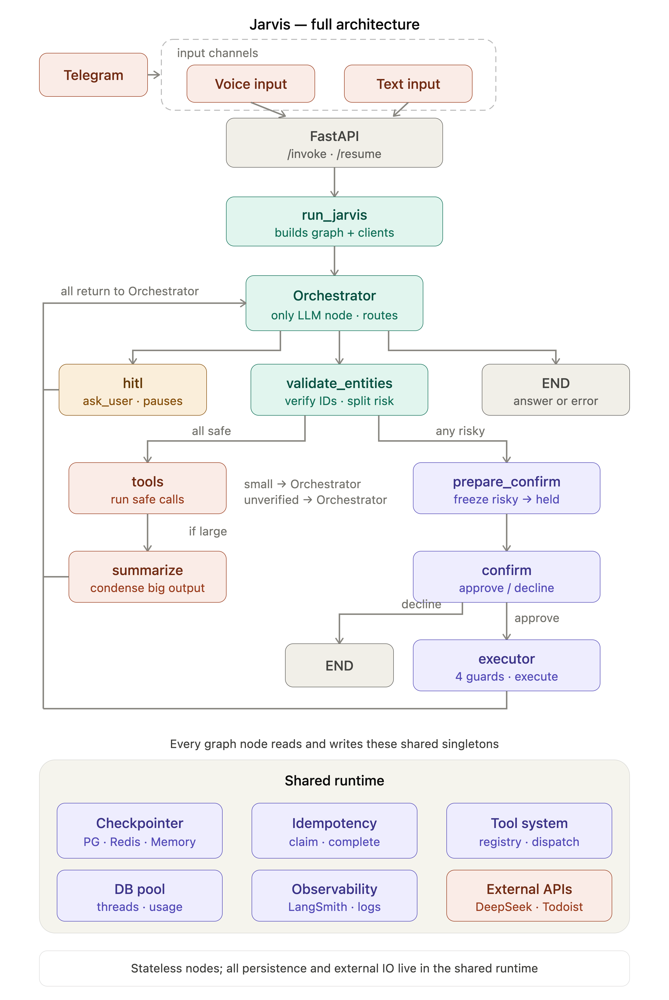

# Jarvis

A personal Telegram assistant built on a Python LangGraph agent that manages Todoist tasks through natural language.

## Architecture

### Input channels & API

Telegram (voice or text) hits the **FastAPI** service at `/invoke` and `/resume`. Voice input is transcribed before entering the same path as text.

### Graph nodes

**run_jarvis** builds the graph and injects clients, then hands control to the **Orchestrator**.

The **Orchestrator** is the only LLM-powered node. It routes every turn to one of:

| Target | Role |
|--------|------|
| **hitl** | Pauses the graph and asks the user for clarification (`ask_user`) |
| **validate_entities** | Verifies task IDs and splits actions into safe vs. risky |
| **END** | Returns a final answer or error to the caller |

From **validate_entities**, the graph branches:

- **All safe** → **tools** executes the calls directly.
  - If output is large → **summarize** condenses it before returning to the orchestrator.
  - If output is small or IDs were unverified → returns to the orchestrator.
- **Any risky** → **prepare_confirm** freezes the risky operations into a held payload → **confirm** presents them for approval.
  - Approve → **executor** applies 4 guards then executes.
  - Decline → END.

All paths return to the orchestrator for the next routing decision.

### Shared runtime

Every graph node is stateless. Persistence and external IO live in shared singletons:

| Singleton | Responsibility |
|-----------|---------------|
| **Checkpointer** | Graph state persistence (PG, Redis, or Memory) |
| **Idempotency** | Claim/complete to prevent duplicate Todoist mutations |
| **Tool system** | Registry and dispatch for all Todoist tools |
| **DB pool** | Connection threads and usage tracking |
| **Observability** | LangSmith tracing and structured logs |
| **External APIs** | DeepSeek (LLM) and Todoist (task CRUD) |
