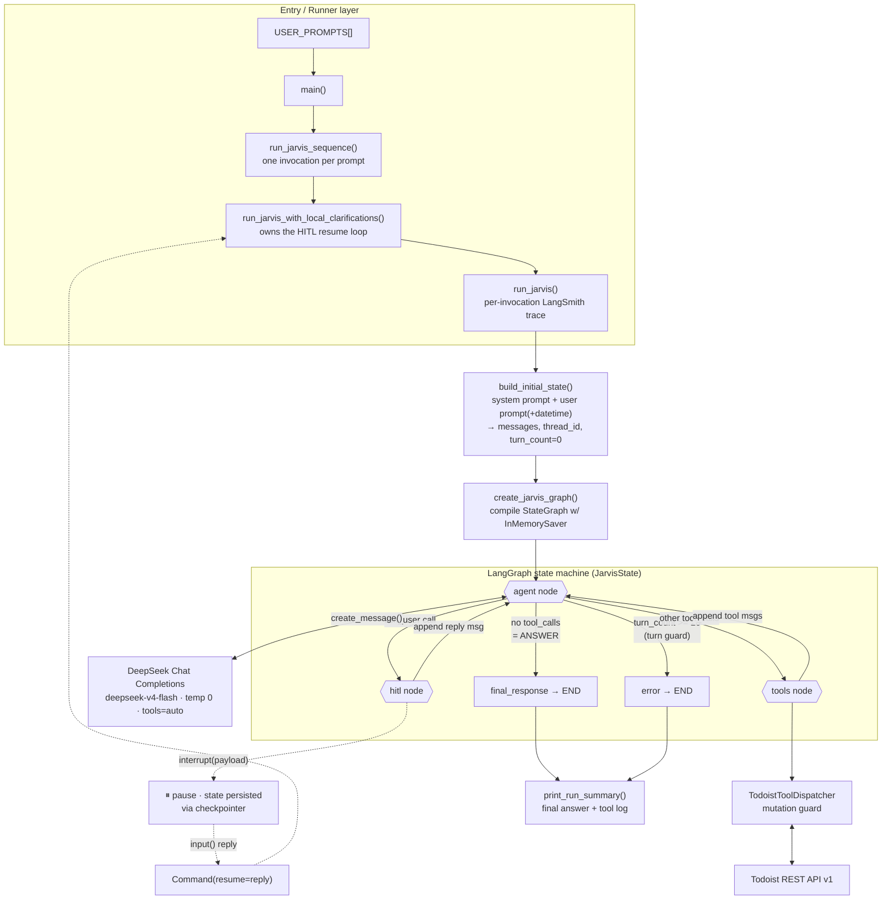
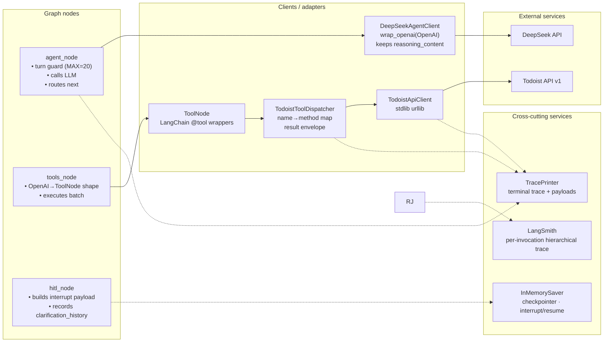
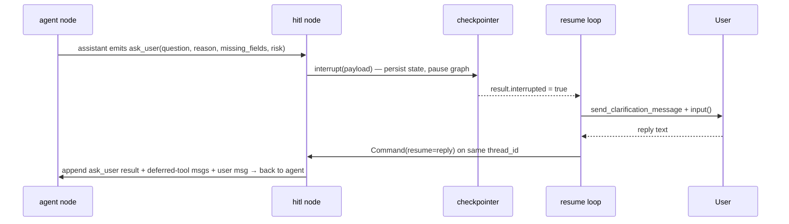

# Jarvis — Agentic System Architecture (Current State)

A single-file **LangGraph** agent/tool loop. One DeepSeek-backed agent node thinks,
a tools node executes Todoist actions, and an HITL node pauses for clarification.
Everything below reflects what is *actually wired in `jarvis.py`* today — not the
orchestrator/worker design the prompt aspires to (see the gap note at the bottom).

---

## 1. End-to-end flow: user prompt → answer

---

## 2. Component / service breakdown

---

## 3. What happens on each `agent` turn (the loop heart)

| Branch (evaluated in order) | Trigger | Next node |
|---|---|---|
| **Turn guard** | `turn_count >= MAX_AGENT_TURNS (20)` | `END` with error |
| **ANSWER** | assistant message has **no** `tool_calls` | `END`, content → `final_response` |
| **ASK_USER** | any tool call named `ask_user` | `hitl` |
| **TOOL_CALL** | any other tool call(s) | `tools` |

The assistant message is appended raw (`reasoning_content` preserved) so DeepSeek
thinking metadata survives across tool turns.

---

## 4. Tool catalogue (the agent's action surface)

| Tool | Type | Mutating? | Backing call |
|---|---|---|---|
| `ask_user` | pseudo-tool | — | routes to **hitl** `interrupt()` |
| `get_tasks` | read | no | `GET /tasks` |
| `get_tasks_by_filter` | read | no | `GET /tasks/filter` |
| `get_todoist_task` | read | no | `GET /tasks/{id}` |
| `get_completed_todoist_tasks_by_completion_date` | read | no | `GET /tasks/completed/by_completion_date` |
| `add_todoist_task` | write | **yes** | `POST /tasks` |
| `update_todoist_task` | write | **yes** | `POST /tasks/{id}` |
| `complete_task` | write | **yes** | `POST /tasks/{id}/close` |
| `delete_todoist_task` | write | **yes** | `DELETE /tasks/{id}` |

**Mutation guard:** the 4 writes are blocked unless `ALLOW_MUTATIONS = True`,
returning `mutation_blocked` instead of hitting the API — so a prompt experiment
can't accidentally mutate real Todoist data.

---

## 5. HITL (human-in-the-loop) clarification path

Only **one** clarification question is honored per HITL turn; extra `ask_user`
calls and any sibling tool calls are recorded as *deferred* so the next agent
turn knows they didn't run.

---

## 6. Observability (the "small services" running alongside)

- **LangSmith** — one correlated, hierarchical trace per `/invoke` or `/resume`.
  `run_jarvis` names the root run `jarvis.invoke` / `jarvis.resume` and attaches
  metadata (`request_id`, `thread_id`, `invocation_type`, `user_id`,
  `request_source`, `model`, `allow_mutations`, `max_agent_turns`). Native
  LangGraph tracing emits the node spans (`agent` / `tools` / `hitl`), and the
  existing `@traceable` / `wrap_openai` decorators emit child spans for each
  DeepSeek call (with retries + token usage), each tool execution, and each
  Todoist HTTP request. Governed solely by `LANGSMITH_TRACING`; tracing is
  best-effort and never fails the Jarvis request.
  - **Correlation** — group a conversation by `thread_id`; tie a trace back to a
    Telegram update by `request_id` (generated in TypeScript at the webhook,
    propagated through FastAPI, and generated at the API boundary if a caller
    omits it). Each invoke/resume is its own trace; a resume is linked to its
    invoke by shared `thread_id` + `request_id`.
  - **Privacy** — raw inputs (prompts, tool args) and outputs (completions,
    reasoning content) are hidden by default via `LANGSMITH_HIDE_INPUTS` /
    `LANGSMITH_HIDE_OUTPUTS` (set automatically from `langsmith_hide_payloads`);
    safe metadata/tags are retained. Todoist URLs are reduced to endpoint
    templates (`/tasks/{id}`) so identifiers never reach traces or logs. Set
    `JARVIS_TRACE_PAYLOADS=1` to temporarily capture full payloads for debugging.
- **TracePrinter** — structured terminal output of every stage + truncated payloads
  (`JARVIS_DEBUG`, `JARVIS_DEBUG_PAYLOADS`).
- **Per-run file logs** (`logs/jarvis_run_*.log`) — the on-disk fallback when
  LangSmith is unavailable. Header carries `request_id`/`thread_id`; the footer
  records duration and aggregated DeepSeek token totals (prompt/completion/total
  plus cached/reasoning when the provider returns them). Auto-disabled under
  pytest; payload bodies are opt-in via `JARVIS_DEBUG_PAYLOADS`.
- **InMemorySaver** — LangGraph checkpointer keyed by `thread_id`; the thing that
  makes `interrupt()` / `Command(resume=…)` work across runs.

---

## ⚠️ Current-state gap (design vs implementation)

The `ORCHESTRATOR_PROMPT` instructs the model to choose between
**ASK_USER / TOOL_CALL / DISPATCH / ANSWER**, and a full `WORKER_PROMPT` exists —
but **DISPATCH is not implemented**. There is no `dispatch_workers` tool and no
worker graph nodes. Today the runtime is a **single-agent** `agent → tools → agent`
loop (plus `hitl`). `CURRENT_GRAPH_COMPATIBILITY_NOTE` says this explicitly, so the
model is told only ANSWER / TOOL_CALL / ASK_USER actually work. The multi-agent
orchestrator/worker layer is the **next** build step, not the current one.
