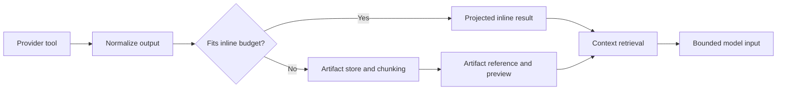

# Tool-Result and Long-Document Context Architecture

## Summary

Replace the current Todoist-specific “summarize large lists” design with a domain-neutral context pipeline that supports structured records and long documents from Todoist, Notion, Gmail, and Google Drive.

The key architectural rule is:

> Large provider payloads never enter LangGraph message history directly. They are normalized, stored as thread-scoped artifacts, and represented in model context by compact references plus query-relevant passages.

This separates:

- Canonical conversation history from the bounded prompt sent to the model.
- Raw source content from compact tool observations.
- Exact source evidence from lossy summaries.
- Provider-specific fetching from domain-neutral storage, retrieval, and budgeting.

The existing plan’s Todoist projection remains useful, but byte-triggered LLM summarization and destructive history elision become fallback mechanisms rather than the primary architecture.

## Implementation Changes

### 1. Establish typed tool-output and context contracts

Extend `ToolSpec` with an `output_policy`:

```python
@dataclass(frozen=True)
class ToolOutputPolicy:
    kind: Literal["mutation", "recordset", "document", "scalar"]
    inline_token_limit: int
    normalizer: Optional[Callable[[Any], NormalizedToolOutput]] = None
    sensitive: bool = False
```

Use a versioned envelope for every tool result:

```json
{
  "schema_version": 2,
  "tool_call_id": "call_123",
  "tool_name": "notion_fetch",
  "success": true,
  "delivery": "inline|artifact",
  "content": {},
  "artifacts": [],
  "error": null,
  "is_mutation": false
}
```

Define a provider-neutral document contract:

```python
class SourceDocument:
    source: Literal["notion", "gmail", "google_drive"]
    source_id: str
    revision: Optional[str]
    title: str
    canonical_url: Optional[str]
    media_type: str
    text: str
    metadata: Dict[str, JsonValue]
```

Provider adapters normalize results as follows:

- Notion pages: enhanced Markdown with page ID, URL, title, timestamps, and revision metadata.
- Gmail: one normalized document per message, preserving thread/message IDs, sender, recipients, subject, timestamp, and decoded text body.
- Drive: exported textual content with file ID, URL, MIME type, owner, and modified time.
- Binary attachments are metadata-only until a separate extraction pipeline exists.
- Todoist lists remain `recordset` outputs and use field projection, not document chunking.

### 2. Add a thread-scoped artifact and chunk store

Create a context-store interface independent of Postgres:

```python
class ContextStore(Protocol):
    def ingest(document, *, user_id, thread_id, ttl) -> ArtifactRef: ...
    def search(query, *, user_id, thread_id, artifact_ids, limit) -> list[Passage]: ...
    def read(artifact_id, *, user_id, thread_id, chunk_ids, token_limit) -> list[Passage]: ...
    def delete_thread(thread_id, *, user_id) -> None: ...
    def purge_expired() -> int: ...
```

Initial Postgres implementation:

- `context_artifacts`: ownership, source identity, revision, title, URL, media type, content hash, byte/token counts, expiry, and status.
- `context_chunks`: ordered chunk text, heading path, character offsets, token count, citation label, full-text-search vector, and optional embedding.
- Unique identity: `(user_id, thread_id, source, source_id, revision)`.
- Re-fetching an unchanged revision reuses the existing artifact; a changed revision creates a new artifact and marks the prior version superseded.
- Every read filters by both resolved `user_id` and `thread_id`; RLS is enabled using the repository’s current service-role posture.
- Default raw-content TTL is 24 hours after the thread’s last activity. Expiry removes chunks and raw content while retaining only compact provenance and aggregate telemetry.
- Thread deletion and user deletion cascade to all artifacts.
- Raw source text, passages, email addresses, and document titles never appear in logs; logging records IDs, hashes, counts, sizes, and timings only.

Chunk documents structurally before indexing:

- Split first on Markdown headings, email message boundaries, paragraphs, and list/table boundaries.
- Target 800 tokens per chunk, 120-token overlap, hard maximum 1,200 tokens.
- Preserve heading path and exact character offsets for citation and reconstruction.
- Never use an LLM to create the canonical chunk text.

Implement hybrid retrieval behind one interface:

- PostgreSQL full-text search and metadata filters are always available.
- Optional embeddings add semantic candidates when an embedding provider is configured.
- Merge lexical and semantic candidates with reciprocal-rank fusion, then cap duplicate adjacent chunks.
- If embeddings are unavailable or fail, retrieval degrades to lexical search without failing the user request.

### 3. Replace raw tool observations with artifact-aware processing

Add a domain-neutral `process_tool_outputs` stage after tool execution:



Processing rules:

- Scalars, mutations, and small projected recordsets remain inline.
- Document outputs and oversized recordsets are persisted before a tool message is created.
- The tool message contains an artifact reference, metadata, a short deterministic preview, and retrieval instructions—never the full document.
- `tool_results` stores the same compact envelope and must not duplicate raw content held by the artifact store.
- Failed ingestion returns a bounded provider error; it must not fall back to injecting the full raw payload into messages.
- A successfully ingested document remains available even if automatic retrieval or summarization later fails.

Register two internal read-only tools for iterative research:

```text
search_context(query, artifact_ids?, source?, limit=8)
read_context(artifact_id, chunk_ids, token_limit?)
```

Both tools:

- Enforce user/thread ownership internally.
- Return stable citation handles such as `[notion:artifact_id:chunk_4]`.
- Include source title, URL where available, heading/message metadata, and exact passage text.
- Apply a hard per-call evidence budget.
- Reject arbitrary offsets or artifact IDs outside the active thread.

Automatically retrieve an initial evidence set after a document fetch using the current user request. The model can call the internal tools when it needs another section, exact wording, comparisons, or follow-up evidence.

### 4. Build a token-budgeted prompt projection

Introduce a pure `ContextManager.prepare_model_input(...)` step immediately before every model call. It receives canonical state and returns a bounded prompt projection without rewriting the artifact store or audit records.

Budget against the selected model’s configured context window:

```text
available input =
  model context window
  - maximum output tokens
  - fixed safety reserve
```

Allocate the available input in priority order:

1. System prompt and selected tool schemas.
2. Current user request and clarification/confirmation state.
3. Complete current tool-call batch, including errors and mutations.
4. Retrieved source passages required for the current request.
5. Recent conversational turns.
6. Rolling conversation summary.
7. Compact historical tool stubs and artifact references.

Rules:

- Use token estimates for preflight budgeting; retain byte counts as operational telemetry.
- Never split assistant tool calls from their matching tool-result messages.
- Never truncate the current user message, confirmation state, provider errors, or retrieved citation metadata.
- Drop redundant evidence and adjacent duplicate chunks before shortening passages.
- If fixed content alone exceeds the model limit, fail with a controlled “request too large” response rather than relying on provider rejection.
- Keep canonical checkpoints compact by ensuring raw artifacts never enter `messages`; do not use LangGraph checkpoint rows as document storage.
- Maintain a rolling conversation summary for old ordinary chat turns. Summaries contain durable decisions, named entities, artifact references, and unresolved questions, but never replace source passages required for quotations.

Replace the current Todoist-specific summarize node with two optional services:

- `RecordsetReducer`: deterministic projection, filtering, grouping, and pagination for large structured lists.
- `ArtifactSummarizer`: cached, query-aware overview for navigation only. It may improve latency but is never the sole retained representation of a document.

Remove these unsafe assumptions from the existing plan:

- Item count is not a proxy for context size.
- A one-element wrapper does not make arbitrary document text a task list.
- Descriptions cannot be discarded globally because document analysis may depend on them.
- “Immediately followed by an assistant message” is not a valid consumed-result test with parallel tool calls.
- Preserving only a percentage of IDs is insufficient validation for exact source recall.

Tag tool batches with `run_id`, `turn_id`, and `batch_id`. Collapse successful mutation bodies only after the entire batch has been consumed, retaining the mutation target, resulting ID, revision, and status. Preserve failed mutations until their error has been summarized into durable conversation state.

### 5. Delivery stages, observability, and rollout

1. **Measurement and contracts**
   - Record estimated input tokens, provider-reported prompt tokens, serialized bytes, per-role contribution, tool-result sizes, and model context headroom.
   - Add `ToolOutputPolicy`, v2 envelopes, batch identity, and compatibility parsing for existing v1 envelopes.
   - Update all new diagnostics through `RunFileLog`/`FileLoggingTracer`; flush logs before assertions.

2. **Bounded structured results**
   - Apply Todoist field projection and `RecordsetReducer`.
   - Add token-based inline limits and deterministic bounded fallbacks.
   - Keep the current summarizer behind a kill switch only during migration.

3. **Artifact storage and retrieval**
   - Add migrations, `ContextStore`, structural chunking, lexical retrieval, ownership checks, TTL cleanup, and the two internal context tools.
   - Route synthetic large-document fixtures through artifacts without requiring live connectors.

4. **Prompt projection and history lifecycle**
   - Introduce model capability/context-window configuration and `ContextManager`.
   - Add rolling conversation summaries and tool-batch-aware collapse.
   - Stop cumulative growth in both `messages` and `tool_results`.

5. **Connector adoption**
   - Make future Notion, Gmail, and Drive fetch handlers return `SourceDocument`.
   - Add optional embeddings and hybrid rank fusion without changing connector contracts.
   - Remove the legacy Todoist-only summarize routing after artifact and recordset paths have proven stable.

Feature flags:

- `JARVIS_CONTEXT_PIPELINE_V2`
- `JARVIS_ARTIFACT_STORE_ENABLED`
- `JARVIS_CONTEXT_TTL_SECONDS`
- `JARVIS_INLINE_TOOL_TOKEN_LIMIT`
- `JARVIS_CONTEXT_INPUT_RATIO`
- `JARVIS_CONTEXT_RETRIEVAL_LIMIT`
- `JARVIS_EMBEDDINGS_ENABLED`

Roll out with shadow metrics first, then enable per environment. Kill switches revert to bounded inline results, never to unlimited raw payloads.

## Public Interfaces and Compatibility

- `ToolSpec.output_policy` defaults to `scalar` with the existing inline behavior so current tools continue to work.
- `ToolResultEnvelopeV2` is accepted alongside existing envelopes during migration.
- `JarvisState` gains compact `artifact_refs`, `conversation_summary`, and tool-batch metadata; it does not contain raw documents or embeddings.
- `DomainAdapter` remains the integration registration point. New providers supply clients, tool specs, prompt fragments, and normalizers without changing graph orchestration.
- API responses continue exposing `tool_results`, but artifact results expose metadata and handles only; raw private content is not returned unless explicitly read through an authorized endpoint/tool.
- Citation handles are internal stable identifiers. User-facing answers render source title and canonical URL while retaining the handle in structured trace metadata.

## Test Plan and Acceptance Criteria

### Unit and contract tests

- Every output policy selects the correct inline/artifact path at boundary sizes.
- V1 and v2 envelopes parse correctly; malformed envelopes fail boundedly.
- Chunking preserves complete ordered text, stable offsets, heading paths, and overlap limits.
- Artifact ingestion is idempotent for identical revisions and versions changed documents.
- Search/read cannot cross user or thread boundaries.
- Lexical fallback works when embeddings are disabled or fail.
- Prompt budgeting preserves tool-call/result pairs and never exceeds the configured input budget.
- Mutation collapse handles parallel batches and preserves failures.
- Log tests flush async run logs and prove source text and sensitive metadata are absent.

### Integration scenarios

- Fetch a 200 KB Notion page, answer from a late section, and return a valid passage citation without placing the full page in `messages` or checkpoints.
- Fetch a long Gmail thread, distinguish senders and dates, quote an exact passage, and prevent access from another user/thread.
- Fetch multiple Drive documents, compare evidence across files, and cite each source independently.
- Continue a thread after process restart while its artifacts are live; repeat after expiry and receive a clear refetch requirement.
- Re-fetch a changed provider revision and answer from the newest version without mixing stale chunks.
- Run an eight-turn Todoist conversation and verify prompt size plateaus while recent task IDs remain actionable.
- Simulate storage, embedding, summarizer, and provider failures independently; none may inject an unbounded raw payload.

### Quantitative gates

- No serialized model request exceeds its calculated input budget.
- No individual tool observation exceeds its configured inline-token ceiling.
- Raw document size in LangGraph checkpoints remains zero.
- Retrieval evaluation includes exact-ID, exact-phrase, date/sender, semantic, and cross-document queries; target recall@8 is at least 90% on the curated fixture set.
- Citation validation confirms every cited passage is an exact substring of its stored canonical chunk.
- Context telemetry reports median/p95 prompt tokens, budget utilization, inline versus artifact counts, retrieval latency, ingestion latency, fallback counts, and expired-artifact misses.
- Run the Python agent suite, relevant integration tests, `git diff --check`, TypeScript tests, lint, and build before each stage merges.

## Assumptions and Defaults

- Fetched content is private, user-owned, and thread-scoped.
- Raw normalized text is retained for 24 hours after last thread activity; only provenance metadata survives expiry.
- Exact recall and source citations are required.
- Retrieval is hybrid when embeddings are configured and lexical-only otherwise.
- PostgreSQL is the initial artifact store; the `ContextStore` abstraction permits later movement of large bodies to Supabase Storage without changing tools or graph nodes.
- Connector implementation and binary attachment extraction are outside the first delivery stages, but their contracts are defined now.
- Byte metrics remain useful operationally, but token budgets—not byte thresholds or list lengths—control model input.
- Stages ship separately and retain compatibility until the v2 pipeline is proven; no stage reintroduces unlimited raw tool results as a fallback.
