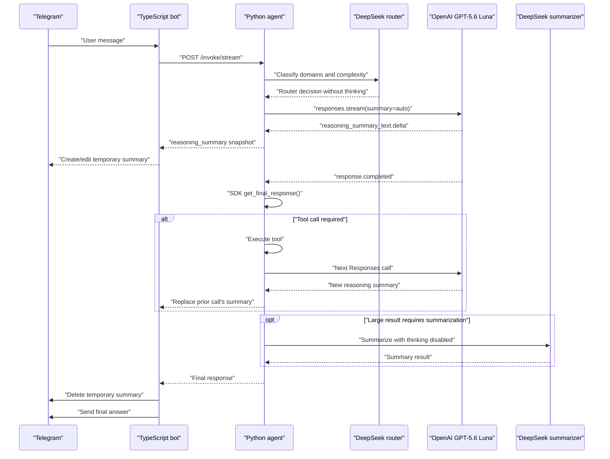

# OpenAI Orchestrator Reasoning Summaries with DeepSeek Router and Summarizer

## Summary

Add OpenAI Responses API reasoning summaries exclusively to the GPT-5.6 Luna orchestrator while retaining DeepSeek for the router and summarizer.

The provider topology remains:

| Role | Provider/API | Reasoning configuration |
|---|---|---|
| Orchestrator | OpenAI Responses, `gpt-5.6-luna` | Configured OpenAI effort plus `summary: "auto"` |
| Query router | DeepSeek Chat Completions | Thinking disabled, `reasoning_effort="off"` |
| Summarizer | DeepSeek Chat Completions | Thinking disabled, `reasoning_effort="off"` |

The implementation will:

- Stream official OpenAI reasoning-summary events into one temporary Telegram message.
- Delete that message before the final answer, interruption prompt, or error.
- Remove the current OpenAI commentary/narration mechanism completely.
- Keep generic progress, tool progress, transcription status, and retry status.
- Keep DeepSeek provider profiles, configuration, requests, pricing, health compatibility, and role selection.
- Stop propagating raw DeepSeek `reasoning_content` because the two remaining DeepSeek roles do not require thinking or tool continuation.
- Never persist reasoning-summary text in checkpoints, final API responses, logs, idempotency records, or LangSmith traces.

This uses OpenAI’s documented [`reasoning.summary`](https://developers.openai.com/api/docs/guides/reasoning#reasoning-summaries) request option and [`response.reasoning_summary_text.delta`](https://developers.openai.com/api/reference/resources/responses/streaming-events#response.reasoning_summary_text.delta) streaming event.

## Target Data Flow



Only the OpenAI orchestrator produces user-visible reasoning summaries. DeepSeek router and summarizer outputs remain internal.

## OpenAI Orchestrator Implementation

### 1. Enable automatic reasoning summaries

Update the existing OpenAI Responses request builder so the orchestrator sends:

```python
{
    "effort": resolved_effort,
    "context": "current_turn",
    "summary": "auto",
}
```

Preserve all existing orchestrator behavior:

- model remains `gpt-5.6-luna`;
- `store=False`;
- `include=["reasoning.encrypted_content"]`;
- tool definitions and `parallel_tool_calls=True`;
- image input handling;
- safety identifier;
- output-token and timeout settings;
- current model-router effort and timeout overrides.

Add one internal request-builder boolean that omits only `summary` when the API explicitly rejects summary support. Do not add an environment flag or user-selectable summary mode.

### 2. Switch orchestrator calls to upstream streaming

Replace only the orchestrator’s non-streaming `responses.create(...)` calls with the installed `openai==2.42.0` stream managers:

- Sync: `with client.responses.stream(...) as stream`
- Async: `async with client.responses.stream(...) as stream`

During iteration:

- Consume `response.reasoning_summary_text.delta`.
- Ignore final-answer token deltas for user delivery.
- Let the SDK reconstruct messages, tools, usage, status, and output items.
- After the stream finishes, call `stream.get_final_response()`.
- Pass that reconstructed response into the existing Responses normalizer.

Do not hand-build the completed response. This preserves existing support for:

- parallel function calls;
- encrypted reasoning continuation;
- image inputs;
- refusals and incomplete responses;
- provider request IDs;
- token usage and pricing records.

The context manager must cover the full iteration so exceptions and cancellation close the upstream connection.

### 3. Produce bounded, drop-safe snapshots

Each OpenAI model call gets a fresh local summary accumulator.

Rules:

- Append deltas in upstream sequence order.
- Insert a blank line when `summary_index` changes.
- Keep only the latest 3,800 display characters.
- Prefix clipped text with `…\n`.
- Emit the first nonempty snapshot immediately.
- Emit subsequent snapshots at most every 250 ms.
- Flush the latest dirty snapshot when a summary part finishes or before processing the completed response.
- Never emit empty snapshots.

The Python-to-TypeScript event contains the complete current display snapshot, not a raw delta. This ensures the existing bounded progress queue can drop intermediate events without corrupting the next update.

A new tool-loop model call starts from an empty accumulator. Its first short snapshot replaces the prior call’s longer summary without requiring a new call-ID protocol.

### 4. Keep summaries optional

If OpenAI completes normally but emits no summary:

- Emit no reasoning-summary event.
- Continue with the tool call or final answer.
- Do not retry merely because the summary is absent.

If OpenAI rejects the `summary` option:

- Recognize only HTTP 400/403 errors whose structured parameter/body identifies `reasoning.summary`, reasoning summaries, summarizer eligibility, or organization verification.
- Retry the same model call exactly once with only the `summary` key omitted.
- Preserve the effort, context, tools, images, safety identifier, timeouts, encrypted-content inclusion, and `store=False`.
- Do not classify unrelated tool-schema, image, authentication, rate-limit, or malformed-input errors as summary failures.
- If the fallback request fails, use the existing retry and terminal-error behavior.

No summary support is added to DeepSeek calls.

### 5. Preserve retry safety

Existing Tenacity retries continue to wrap the complete OpenAI stream.

If a stream fails after emitting a partial summary:

- Keep the partial summary visible until the next attempt produces its first snapshot.
- Replace it with the new attempt’s snapshot.
- Delete it on terminal failure.

No tool is executed until the OpenAI stream completes and the final response is normalized, preventing duplicated mutations when a streamed attempt is retried.

## Remove OpenAI Commentary/Narration

### 1. Remove commentary from model results

Delete `ModelCallResult.commentary` and every loop that forwards commentary through `tracer.narration(...)`.

In OpenAI Responses normalization:

- Ignore messages with `phase="commentary"`.
- When unresolved function calls exist, treat unphased assistant text as an intermediate preamble and ignore it.
- Do not include either form in final content.
- Do not include either form in continuation replay.
- Continue rejecting a `final_answer` message accompanying unresolved function calls.
- With no unresolved function calls, accept `phase="final_answer"` and legacy unphased assistant text as final output.
- Continue enforcing refusal metadata even if a refusal is attached to a discarded intermediate message.

Remove the graph-level fallback that currently turns assistant text accompanying tool calls into narration.

### 2. Replace the narration channel

Rename the Python side-channel method:

```text
narration(text)
```

to:

```text
reasoning_summary(text)
```

Replace the NDJSON event:

```json
{
  "type": "narration",
  "sequence": 12,
  "text": "..."
}
```

with:

```json
{
  "type": "reasoning_summary",
  "sequence": 12,
  "text": "Complete current display snapshot"
}
```

Contract rules:

- `sequence` is positive and monotonically increasing.
- `text` is nonempty.
- `text` is already bounded for Telegram display.
- The event appears only on `/invoke/stream` and `/resume/stream`.
- Existing `progress` and `final` event shapes remain unchanged.
- Standard non-streaming endpoints expose no reasoning summary.

Remove the old narration schema, fixture, reporter naming, callbacks, and narration-specific tests.

## Continuation and Persistence Boundaries

### 1. Retain only necessary OpenAI continuation data

For OpenAI tool continuation, retain:

- reasoning item ID/type/status;
- `encrypted_content`;
- function-call items.

Before writing a continuation checkpoint:

- Remove the reasoning item’s `summary` array.
- Drop assistant commentary/preamble message items.
- Preserve function-call IDs, names, arguments, and encrypted reasoning.
- Preserve tool-call correlation validation.

When an older OpenAI checkpoint contains commentary or summary arrays, accept it, remove those fields during canonicalization, and write the cleaned form on the next checkpoint update.

### 2. Remove public raw-reasoning propagation

Delete `reasoning_content` / `reasoningContent` from:

- graph state and graph results;
- Python `AgentResponse`;
- invoke/resume response construction;
- TypeScript response schemas;
- normalized client response types;
- Telegram message/audio/photo processors;
- API fixtures and contract tests.

Do not replace it with a final-response reasoning-summary field. Reasoning summaries remain stream-only.

### 3. Handle old DeepSeek orchestrator checkpoints

Keep a one-release read-only checkpoint compatibility branch:

- Recognize legacy `continuation.provider == "deepseek"`.
- Recognize legacy assistant `reasoning_content`.
- Discard the raw reasoning text.
- Preserve ordinary assistant content and tool-call IDs.
- Produce a canonical message without DeepSeek continuation metadata.
- Continue the thread through the current OpenAI Responses orchestrator.
- Remove the old fields on the next checkpoint write.

This compatibility reader must not be used for new DeepSeek router or summarizer calls. Those roles do not produce graph tool-continuation checkpoints.

Remove this bridge in the release after the migration release.

## DeepSeek Router and Summarizer Preservation

### Provider configuration

Do not perform the previously proposed DeepSeek provider cleanup.

Retain:

- `LLMProvider.DEEPSEEK`;
- `DeepSeekProfile`;
- DeepSeek API key/base URL/model configuration;
- DeepSeek Chat Completions request handling;
- DeepSeek retry and timeout settings;
- DeepSeek token pricing;
- DeepSeek health/status compatibility;
- service exports still used by router/summarizer;
- role-specific provider configuration.

The intended deployment configuration remains:

```text
LLM_PROVIDER=openai
ROUTER_PROVIDER=deepseek
SUMMARIZER_PROVIDER=deepseek

OPENAI_MODEL=gpt-5.6-luna
OPENAI_API_KEY=...
LLM_SAFETY_IDENTIFIER_SECRET=...

DEEPSEEK_API_KEY=...
DEEPSEEK_MODEL=...
DEEPSEEK_BASE_URL=...
```

The existing configuration system should continue constructing:

- `OpenAIResponsesProfile` for the orchestrator;
- `DeepSeekProfile` for the router;
- `DeepSeekProfile` for the summarizer.

### DeepSeek reasoning behavior

Both remaining DeepSeek roles operate without thinking:

- router `reasoning_effort="off"`;
- summarizer `reasoning_effort="off"`;
- `thinking.type="disabled"` when the DeepSeek compatibility API requires an explicit setting;
- no DeepSeek `reasoning_content` is captured, replayed, streamed, or exposed.

If DeepSeek unexpectedly returns `reasoning_content`, ignore it.

Do not request OpenAI-style reasoning summaries from DeepSeek.

### Preserve router behavior

Keep the router:

- noncritical;
- fast and tightly timeout-bounded;
- able to fall back to the static/all-tools selector;
- internally responsible only for domain, uncertainty, and complexity classification;
- excluded from the user-facing reasoning-summary stream.

The model router may still choose OpenAI orchestrator model effort and timeout, but it must select only OpenAI-compatible orchestrator models.

### Preserve summarizer behavior

Keep the DeepSeek summarizer:

- internal to large tool-result reduction;
- non-streaming to the user;
- configured with thinking disabled;
- subject to its existing concurrency, timeout, retry, token-ceiling, and coverage validation;
- priced through existing DeepSeek usage records.

A DeepSeek summarizer response must never overwrite or appear inside the OpenAI reasoning-summary Telegram message.

## Prevent Summary Persistence and Trace Leakage

Reasoning-summary text may exist only in:

- the active OpenAI SDK stream/response object;
- the bounded per-call display accumulator;
- transient NDJSON objects;
- the active TypeScript summary reporter;
- the temporary Telegram message.

It must not enter:

- canonical messages;
- checkpoints;
- graph state;
- final `AgentResponse`;
- idempotency records;
- Python run logs;
- TypeScript logs;
- DeepSeek router/summarizer inputs;
- LangSmith raw OpenAI child spans.

For OpenAI Responses calls, wrap the upstream SDK stream in:

```python
tracing_context(enabled=False)
```

This prevents the wrapped OpenAI client from persisting raw streamed summary events. Keep the outer sanitized model-call trace, which receives only the normalized canonical result and safe metadata.

Safe metadata may include:

- `reasoning_summary_requested: bool`
- `reasoning_summary_streamed: bool`
- `reasoning_summary_chars: int`
- `reasoning_summary_fallback: bool`

Never log summary text, deltas, text previews, summary indexes, or Telegram-rendered content.

DeepSeek router/summarizer logging remains unchanged except that raw `reasoning_content` must not be logged.

## TypeScript and Telegram Integration

### 1. Stream contract

Replace `StreamNarrationEventSchema` with `StreamReasoningSummaryEventSchema`.

Update the progress callback object to expose:

```ts
reasoningSummary?: string;
```

When a reasoning-summary event arrives:

- Forward the full snapshot to the summary reporter.
- Do not copy the text into generic `message`, metadata, or logs.
- Continue consuming later stream events if reporter delivery fails.
- Preserve the existing progress-callback timeout and failure isolation.

An older bot may ignore the new event and still process the final response. A newer bot may ignore an old narration event during a rolling deployment.

### 2. Plain ephemeral reporter

Rename the narration reporter to a reasoning-summary reporter.

Behavior:

- Create no message until the first nonempty summary.
- Send one MarkdownV2 message.
- Keep only the latest desired snapshot.
- Coalesce Telegram edits to at most one per second.
- Return immediately from `record(...)`; use one in-flight delivery pump.
- Use existing Markdown reply/edit helpers.
- Treat “message is not modified” as success.
- Recreate the temporary message if Telegram reports it missing.
- Apply a defensive 3,800 UTF-16-code-unit limit in TypeScript.
- Do not use Telegram rich drafts.
- Do not split the summary into multiple messages.
- Do not log summary text.

On completion, interruption, failure, cancellation, stale-owner suppression, or handler exception:

- stop scheduled updates;
- await the active update;
- delete the temporary message;
- clear retained text and message IDs;
- prevent late edits after completion.

### 3. Handler lifecycle

Text, photo, voice, and audio handlers must:

- send `reasoningSummary` events to the summary reporter;
- keep structured progress facts in the existing generic progress reporter;
- delete the summary before sending a final answer;
- delete it before showing confirmation or clarification prompts;
- delete it on every error/cancellation path.

The generic progress message remains separate. A turn can temporarily display both generic tool/activity status and an OpenAI reasoning summary.

## Public Interface Changes

| Surface | Change |
|---|---|
| OpenAI orchestrator request | Add `reasoning.summary: "auto"` |
| DeepSeek router request | Unchanged; thinking remains disabled |
| DeepSeek summarizer request | Unchanged; thinking remains disabled |
| Python stream | Replace `narration` with `reasoning_summary` snapshots |
| TypeScript callback | Replace `narration?: string` with `reasoningSummary?: string` |
| Final response | Remove `reasoning_content`; add no summary field |
| OpenAI checkpoint | Keep encrypted reasoning/function calls; remove summary/commentary |
| DeepSeek configuration | Retained for router and summarizer |
| Provider selection | Retained with OpenAI orchestrator and DeepSeek role overrides |
| Pricing | Retain both OpenAI and DeepSeek pricing |
| Telegram | One coalesced plain temporary summary message |

## Test Plan

### OpenAI request and stream tests

- Orchestrator request includes:
  - `summary="auto"`;
  - configured effort;
  - `context="current_turn"`;
  - encrypted-content inclusion;
  - `store=False`;
  - tools, images, safety ID, timeout, and output-token settings.
- Sync and async streams reconstruct final responses through `get_final_response()`.
- Summary tests cover:
  - one summary part;
  - multiple deltas;
  - multiple summary indexes;
  - no summary;
  - tool calls;
  - multiple orchestrator calls;
  - image input;
  - final flush;
  - clipping;
  - 250 ms backend coalescing.
- Stream cancellation closes the SDK stream manager.

### Optional-summary fallback tests

- Summary-specific 400 retries once without `summary`.
- Summary-specific 403/verification failure retries once.
- Unrelated 400 does not trigger fallback.
- Authentication, rate-limit, image, tool-schema, and timeout behavior remains unchanged.
- No-summary success does not retry.
- Failed fallback does not loop.

### Commentary and persistence tests

- Commentary-phase messages are absent from content, replay, checkpoints, and stream events.
- Unphased tool preambles are discarded.
- Final-answer and refusal validation remains correct.
- Summary arrays are stripped while encrypted reasoning and function calls replay.
- A sentinel summary string is absent from:
  - graph state;
  - checkpoints;
  - final API responses;
  - idempotency records;
  - flushed run logs;
  - sanitized trace outputs.
- Old OpenAI continuation data is rewritten without commentary/summary.
- Old DeepSeek orchestrator continuation is read, discarded, and resumed through OpenAI.

### Provider-role tests

Verify the actual mixed-provider architecture:

- orchestrator profile is `OpenAIResponsesProfile`;
- orchestrator model is `gpt-5.6-luna`;
- router profile is `DeepSeekProfile`;
- summarizer profile is `DeepSeekProfile`;
- router and summarizer thinking are disabled;
- OpenAI summary parameters never appear in DeepSeek requests;
- DeepSeek `reasoning_content` never enters graph/public results;
- router static fallback remains functional;
- summarizer coverage and concurrency behavior remains functional;
- both OpenAI and DeepSeek usage pricing continues to work;
- startup validation requires both active-provider credentials.

### Stream and Telegram tests

- Python emits valid, monotonic `reasoning_summary` snapshots.
- Dropping an intermediate snapshot does not corrupt later text.
- TypeScript parses and forwards `reasoningSummary`.
- Old narration schemas and fixtures are removed.
- Reporter tests cover:
  - first send;
  - subsequent edit;
  - rapid-update coalescing;
  - duplicate suppression;
  - size limiting;
  - Markdown fallback;
  - missing-message recovery;
  - completion races;
  - deletion on every terminal path;
  - absence of summary text in logs.
- Two-call tool loop confirms the second OpenAI call replaces the same Telegram message.
- DeepSeek router/summarizer activity does not create or modify the summary message.

### Validation commands

Run at minimum:

```text
python3 -m pytest tests/agents/test_llm_responses.py
python3 -m pytest tests/agents/test_llm_messages.py tests/agents/test_llm_chat.py
python3 -m pytest tests/agents/test_router_client.py tests/agents/test_config_router.py
python3 -m pytest tests/agents/test_summarize_node.py tests/agents/test_summarize_parallel.py
python3 -m pytest tests/agents/test_contract.py tests/agents/test_stream_liveness.py
python3 -m pytest tests/agents/test_llm_provider_config.py tests/agents/test_pricing.py
npm test -- --runInBand
npm run build
git diff --check
```

Run the complete Python suite before release.

## Rollout and Acceptance

1. Configure staging with OpenAI orchestrator and DeepSeek router/summarizer role overrides.
2. Confirm the OpenAI organization is eligible for GPT-5.6 reasoning summaries.
3. Run:
   - a simple final-answer turn;
   - a tool-loop turn with multiple OpenAI calls;
   - a large-result turn that invokes the DeepSeek summarizer;
   - a request that exercises the DeepSeek router fallback;
   - an image request.
4. Verify:
   - only OpenAI calls generate reasoning-summary UI;
   - DeepSeek calls remain internal;
   - the second OpenAI call replaces the first summary;
   - the temporary message disappears before terminal output;
   - tool execution and summarization remain correct;
   - summary text is absent from logs, traces, checkpoints, and API responses;
   - summary rejection still produces a valid answer through fallback.
5. Monitor safe metadata:
   - summary requested/present/fallback rates;
   - OpenAI stream errors;
   - Telegram update/delete errors;
   - DeepSeek router fallback rate;
   - DeepSeek summarizer failures;
   - final-response delivery success.
6. Remove the legacy DeepSeek orchestrator-checkpoint bridge in the following release.

## Assumptions and Deliberate Limits

- OpenAI GPT-5.6 Luna is the only orchestrator.
- DeepSeek remains the router and summarizer provider.
- DeepSeek thinking stays disabled for both remaining roles.
- `summary="auto"` is the only supported reasoning-summary mode.
- Reasoning summaries are optional and best-effort.
- Generic progress remains separate.
- Telegram uses plain editable Markdown with one-second update coalescing and a 3,800-character limit.
- Final-answer token streaming, SSE/WebSockets, summary persistence, summary-content analytics, and additional UI surfaces remain out of scope.
- Existing provider configuration machinery and DeepSeek pricing are preserved.
- Current uncommitted image-support work is user-owned and must be integrated without reverting unrelated changes.
