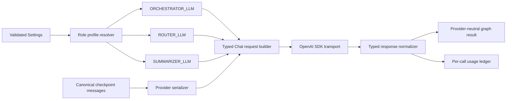

# Feature plan: Safe LLM provider switching (DeepSeek ↔ OpenAI API)

## Status

Compatibility baseline implemented through Stages 0–6 on 2026-08-03. Stage 7
is implemented for the OpenAI orchestrator: GPT-5.6 uses the Responses API,
defaults to medium reasoning, and replays encrypted tool-turn reasoning locally
with `store=false`. OpenAI router and summarizer roles remain on Chat Completions
with reasoning `none`.

Verified release gate:

- `python -m pytest -q tests/agents/`: 1,506 passed, 4 skipped, 28 subtests passed;
- `npm test -- --runInBand`: 698 passed;
- `npm run build`, `npm run lint`, Python compileall, and `git diff --check`: passed;
- the GPT-5.6 Luna medium-reasoning live smoke is opt-in with
  `JARVIS_LIVE_OPENAI_RESPONSES=1` and was not run during this implementation.

GPT-5.6 Luna is now the code default: the orchestrator uses Responses with medium
reasoning, while router and summarizer roles use Chat Completions with reasoning
`none`. OpenAI requires both its API key and `LLM_SAFETY_IDENTIFIER_SECRET`;
DeepSeek remains available through an explicit provider override.

This replaces the earlier assumption that switching providers is only a base URL and API-key change. The current implementation is DeepSeek-shaped at configuration, request, response, retry, usage, pricing, health, logging, and UI boundaries. A safe provider toggle has to address all of them as one migration.

OpenAI-specific claims were rechecked against the official GPT-5.6 and API
documentation on 2026-08-03. `requirements.txt` pins OpenAI Python SDK 2.42.0,
whose typed request surface includes the Responses fields used by Stage 7.

## Outcome

Changing:

```dotenv
LLM_PROVIDER=deepseek
```

to:

```dotenv
LLM_PROVIDER=openai
```

and restarting the process must select a coherent provider profile for every default LLM workload:

- orchestrator;
- query router;
- model router default and complex routes;
- summarizer;
- health and readiness;
- logs, traces, errors, usage, and pricing.

`ROUTER_PROVIDER` and `SUMMARIZER_PROVIDER` may explicitly override the global provider. When unset, they inherit `LLM_PROVIDER`. An override must resolve its own matching key, endpoint, model, request capabilities, and accounting identity.

Provider-independent behavior must not change:

- LangGraph routing and state transitions;
- tool selection and execution;
- parallel function calls;
- confirmation and clarification interrupts;
- narration and progress events;
- cancellation, deadlines, and retries;
- deterministic summarizer fallback behavior;
- synchronous and asynchronous public entry points.

## Scope and API decision

### Baseline: Chat Completions compatibility

Keep the existing non-streaming `chat.completions.create()` loop for both providers in the baseline.

For GPT-5.6, Chat Completions function tools are compatible only with an effective reasoning effort of `none`. GPT-5.6 otherwise defaults to reasoning. Every OpenAI Chat Completions call in this baseline must therefore set `reasoning_effort="none"` explicitly. Reasoning plus tools belongs in a separate Responses API adapter.

The baseline supports:

- text completions;
- Jarvis function tools and parallel tool calls;
- JSON router output followed by local Pydantic validation;
- cached-token, cache-write-token, and reasoning-token accounting when reported;
- provider-neutral health, error, logging, and trace contracts.

The baseline does not adopt:

- Responses API state;
- persisted or encrypted reasoning;
- reasoning summaries;
- OpenAI built-in tools;
- Programmatic Tool Calling;
- OpenAI multi-agent orchestration;
- explicit prompt caching;
- Pro mode;
- provider token streaming.

These are separate product and protocol changes and must not be smuggled into the provider toggle.

### Stage 7 follow-up: Responses API adapter (implemented)

This follow-up was implemented after the compatibility baseline. It adds OpenAI reasoning with Jarvis function tools while leaving native OpenAI tools out of scope.

The Responses adapter needs a separate request, response, and continuation contract. At minimum it must handle:

- output items rather than Chat Completion messages;
- function call/output correlation using `call_id`;
- `previous_response_id` or complete manual item replay;
- all relevant prior output item types, not assistant text alone;
- encrypted reasoning replay for `store=false` or ZDR operation;
- Responses-specific reasoning, tool, cache, and usage fields;
- migration and rollback without corrupting existing checkpoints.

It is Stage 7 in this plan and extends, rather than changes, the Stage 0–6 baseline acceptance requirements.

## Starting provider and model map

Preserve workload roles instead of replacing every model with one flagship model.

| Workload | DeepSeek default | OpenAI baseline | Baseline effort |
| --- | --- | --- | --- |
| Orchestrator default | existing flash model | `gpt-5.6-luna` | `none` |
| Orchestrator complex | existing pro model | `gpt-5.6-sol` | `none` |
| Query router | existing router model | `gpt-5.6-luna` | `none` |
| Summarizer | existing summarizer model | `gpt-5.6-luna` | `none` |

Luna is the starting point for high-volume and latency-sensitive work. Sol preserves the stronger complex-route role. Benchmark Terra against Sol on representative complex requests before changing that starting map.

OpenAI requests must never receive a `deepseek-*` model. DeepSeek requests must never receive a `gpt-*` model unless an explicitly supported proxy configuration is designed later.

The in-progress user preference work currently allows a free-form forced model and a DeepSeek-shaped reasoning enum. The implementation must close this hole before OpenAI is enabled:

- validate a forced model against the active provider profile or a provider-owned allowlist;
- reject an incompatible pin with a clear configuration/runtime error;
- map or reject user reasoning preferences by provider and endpoint capability;
- never silently reinterpret DeepSeek `high` or `max` as OpenAI Chat Completions reasoning.

## Repository findings driving the stages

- `orchestrator.py` owns two SDK paths, shared sync/async clients, retry policy, raw message conversion, usage parsing, and DeepSeek-labelled errors; it is not a single conditional call site.
- `router/client.py` and `summarize.py` construct independent clients and have their own sync/async request and fallback behavior.
- `model_router.py` currently returns model and reasoning strings without a provider capability type.
- graph messages are broad dictionaries, so provider output fields can enter checkpoint history unless serialization is narrowed.
- usage is accumulated before pricing; multi-model runs become `"mixed"` and deliberately lose exact cost.
- Python health, TypeScript readiness/status schemas, Telegram labels, and `start_servers.sh` are explicitly DeepSeek-shaped.
- current uncommitted runtime-preference work can force an arbitrary model and DeepSeek-style reasoning value, creating a new cross-provider escape hatch unless Stage 1 validates it.

## Architecture target

Provider conditionals belong at one adapter boundary, not throughout graph nodes.



### Provider profiles

Add a small module such as `agents/agent_api/app/llm/provider.py` with frozen, discriminated profiles:

```python
class LLMProvider(str, Enum):
    DEEPSEEK = "deepseek"
    OPENAI = "openai"


@dataclass(frozen=True, kw_only=True)
class BaseLLMProfile:
    api_key: str
    base_url: str
    model: str
    max_output_tokens: int
    request_timeout_seconds: float
    max_retry_attempts: int
    retry_max_delay_seconds: float
    sdk_max_retries: int


@dataclass(frozen=True, kw_only=True)
class DeepSeekProfile(BaseLLMProfile):
    provider: Literal[LLMProvider.DEEPSEEK] = LLMProvider.DEEPSEEK
    reasoning_effort: DeepSeekReasoningEffort
    thinking_enabled: bool


@dataclass(frozen=True, kw_only=True)
class OpenAIChatProfile(BaseLLMProfile):
    provider: Literal[LLMProvider.OPENAI] = LLMProvider.OPENAI
    reasoning_effort: Literal["none"] = "none"


LLMProviderProfile = DeepSeekProfile | OpenAIChatProfile
```

Do not weaken provider capabilities to unconstrained strings or `dict[str, Any]`. A future Responses profile is a different union member.

### Canonical message boundary

Checkpointed graph messages must be provider-neutral and versioned. Serialize an allowlisted shape for the target provider:

- `system`: content only;
- `user`: supported content only;
- `assistant`: content plus validated function tool calls and IDs;
- `tool`: tool result content plus the matching tool-call ID.

Never replay an SDK response dump. Strip output-only fields such as OpenAI `annotations`, request IDs, refusal metadata, and unknown extensions.

DeepSeek continuation metadata needs one explicit decision in Stage 0. If DeepSeek requires `reasoning_content` on a tool continuation, preserve only that allowlisted field in a typed, provider-tagged continuation sidecar. The OpenAI serializer must never emit it. Raw provider objects must not be checkpointed.

Existing checkpoints need a migration policy:

1. parse recognized legacy messages into the canonical version;
2. remove fields unsafe for the selected target;
3. preserve tool-call/result correlation;
4. reject an unconvertible checkpoint with a typed `incompatible_checkpoint` error;
5. never send a best-effort malformed provider request.

### Typed request boundary

Use one request builder for synchronous and asynchronous transports:

```python
@dataclass(frozen=True)
class ChatCompletionCall:
    params: CompletionCreateParamsNonStreaming
    extra_body: Mapping[str, object] | None = None


def build_chat_completion_call(
    profile: LLMProviderProfile,
    *,
    messages: Sequence[CanonicalMessage],
    tools: Sequence[ChatCompletionToolParam] = (),
    response_format: ChatCompletionResponseFormatParam | None = None,
    safety_identifier: str | None = None,
) -> ChatCompletionCall:
    ...
```

Required DeepSeek behavior:

- preserve its current token-limit parameter;
- preserve current `reasoning_effort`;
- preserve `extra_body.thinking` exactly;
- preserve retries, timeouts, and transport behavior.

Required OpenAI GPT-5.6 behavior:

- use `max_completion_tokens`, not deprecated `max_tokens`;
- set `reasoning_effort="none"` explicitly;
- never send `extra_body.thinking` or `reasoning_content`;
- omit provider-incompatible sampling fields;
- send a stable privacy-preserving `safety_identifier` for end-user calls;
- keep router JSON validation local in the baseline.

A bare SHA hash of a predictable Telegram ID is not sufficient. Introduce an environment-only `LLM_SAFETY_IDENTIFIER_SECRET` and derive a stable HMAC-SHA256 identifier from a namespaced internal user ID. Send the full 64-character lowercase hex digest, which fits the API limit. Require this secret at startup whenever any enabled role resolves to OpenAI. Never log the source identifier, HMAC key, or full request.

### Typed response boundary

Normalize SDK responses before graph logic consumes them:

```python
FinishReason = Literal[
    "stop",
    "tool_calls",
    "length",
    "content_filter",
    "function_call",
]


@dataclass(frozen=True)
class ModelCallResult:
    message: CanonicalAssistantMessage
    finish_reason: FinishReason
    usage: UsageRecord
    provider: LLMProvider
    requested_model: str
    returned_model: str
    provider_request_id: Optional[str]
    refusal: Optional[str]
```

The normalizer must treat these explicitly:

- missing or empty `choices`;
- `content=None` with valid tool calls;
- `content=None` without tool calls;
- `finish_reason="length"`;
- `finish_reason="content_filter"`;
- a model refusal;
- valid sequential and parallel function calls;
- malformed JSON tool arguments;
- missing or duplicate tool-call IDs;
- missing usage;
- SDK objects and dict fixtures;
- provider request IDs.

Invalid responses produce typed `invalid_response` errors. They must not become empty successful answers.

OpenAI annotations are not part of the baseline because OpenAI-native web tools are out of scope. The normalizer may deliberately discard unexpected annotations after recording a safe count, but must not checkpoint or replay them. Add a public annotations contract only with a product requirement and end-to-end renderer.

### Event and presentation compatibility

Narration, semantic progress, HITL interrupts, and terminal responses are one provider-neutral presentation contract. Provider adaptation must not change when these events are created, their wire shapes, their ordering rules, or their Telegram lifecycle.

Required graph and stream behavior:

- emit narration once for each accepted assistant tool-call turn when assistant content is non-empty after trimming;
- do not emit narration for text-only final answers, null/empty assistant content, refusals, filtered/truncated/invalid responses, or failed model attempts;
- emit one narration event for an assistant turn containing parallel tool calls, not one event per tool call;
- preserve assistant content alongside tool calls through normalization, canonical state, and provider serialization;
- assign narration and progress events from the same monotonically increasing per-stream sequence;
- preserve these NDJSON envelopes exactly:

```json
{"type":"narration","sequence":1,"text":"I’ll check both calendars."}
{"type":"progress","sequence":2,"stage":"progress","message":"Jarvis is working","fact":{"phase":"lookup","action":"started"}}
{"type":"final","response":{"status":"completed","thread_id":"thread_1","response":"Done","tool_results":[]}}
```

- keep final events terminal and highest priority: a saturated bounded queue may drop best-effort narration/progress exactly as today, but it must deliver the final event;
- emit no narration or progress after the final event;
- treat a clarification or confirmation interrupt as the terminal response for that invocation; a later `/resume` starts a new stream and new sequence;
- keep callback, stream, and graph event payloads free of provider-specific fields and labels.

Required TypeScript and Telegram behavior:

- map a narration envelope to the existing progress callback with `stage="narration"`, `message=text`, and `narration=text`;
- keep narration separate from semantic progress rendering;
- trim and deduplicate narration, escape Telegram MarkdownV2, edit one temporary narration message, and remove it during cleanup;
- complete both narration and progress reporters before sending or presenting a completed, interrupted, or failed terminal result;
- apply the same lifecycle to text, voice, audio, and audio-document paths;
- clean up reporters on success, HITL, cancellation, stale-owner suppression, provider failure, Telegram delivery failure, and handler exceptions;
- permit no stale narration/progress message, active keepalive timer, post-completion render, or duplicate terminal reply.

### Usage and pricing boundary

The current aggregate `UsageSummary` loses the relationship between tokens and models, and its `"mixed"` fallback deliberately produces no price. Provider switching makes that insufficient.

Use a per-call ledger:

```python
@dataclass(frozen=True)
class UsageRecord:
    provider: LLMProvider
    requested_model: str
    returned_model: str
    prompt_tokens: int
    completion_tokens: int
    cached_read_tokens: int
    cache_write_tokens: int
    reasoning_tokens: int
    request_input_tokens: int
    pricing_tier: str | None


@dataclass
class UsageLedger:
    calls: list[UsageRecord]
```

Cost each call before aggregation. A bucket keyed only by `(provider, model)` is not enough if a long-context pricing threshold applies per request. Either retain per-call records or include the verified pricing tier in the bucket key.

Parse field presence deliberately rather than using truthiness. Support:

- OpenAI `prompt_tokens_details.cached_tokens`;
- DeepSeek `prompt_cache_hit_tokens`;
- cache-write tokens when reported;
- completion reasoning tokens;
- actual returned model IDs;
- missing usage without inventing zero-cost success.

Pricing data must be provider- and model-specific, sourced from official pricing pages, and include an `as_of` date. Unknown models, unknown tiers, and requests whose tier cannot be derived return `None`, never a guessed cost.

## Delivery strategy

Each stage should be independently reviewable. Stages 1–5 may be separate commits on one feature branch, but OpenAI must not be enabled in production until the Stage 6 release gate passes.

| Stage | Deliverable | Hard gate |
| --- | --- | --- |
| 0 | Executable DeepSeek baseline | Golden requests and retry behavior frozen |
| 1 | Validated role profiles | Invalid keys/models/overrides fail fast |
| 2 | Provider boundary and usage ledger | 12-cell request matrix and malformed-response tests pass |
| 3 | Orchestrator migrated | Tool, HITL, retry, and checkpoint parity pass |
| 4 | Router/model-router/summarizer migrated | No hidden DeepSeek call path remains |
| 5 | Operational contracts migrated | Health, logs, errors, and cost are truthful |
| 6 | Release and canary | Full suites, live smoke, SLO, and rollback gates pass |
| 7 | Optional Responses adapter | Separately approved, tested, and rolled out |

### Stage 0 — Baseline inventory and contract freeze

**Goal:** turn current DeepSeek behavior into an executable baseline before refactoring.

**Work**

- Inventory all LLM entry points, shared clients, settings caches, close hooks, health probes, run metadata, and startup checks.
- Capture the exact current DeepSeek request shape for orchestrator, router, and summarizer in sync and async modes.
- Record current retry ownership: Tenacity attempts, SDK retry count, timeout source, and deadline interaction.
- Decide the canonical message version and the typed DeepSeek continuation sidecar.
- Decide the SDK support policy. The local 2.42.0 client exposes the baseline fields, but `requirements.txt` currently permits older versions. Raise the minimum or add a verified compatibility guard.
- Inventory the in-progress forced-model and reasoning-preference surfaces and define provider validation for them.
- Record representative DeepSeek eval inputs and expected tool-routing outcomes before changing prompts or models.
- Capture golden event traces for text-only completion, single and parallel tool calls, clarification, confirmation, resume, retry/failure, and a saturated stream queue.

**Tests added first**

- Golden kwargs tests for all six current call paths: three workloads × sync/async.
- Golden multi-turn message fixtures: text, one tool, parallel tools, tool results, clarify interrupt, confirm interrupt, and resume.
- Golden narration/progress/final envelopes and ordering for the event traces above.
- Retry/timeout tests proving current attempt counts and deadline behavior.
- A no-network unit-test guard so mocked suites fail if an unexpected live SDK call escapes.
- SDK signature/compatibility smoke test for required Phase 1 fields.

**Exit gate**

- Existing DeepSeek suites pass.
- Golden request fixtures are reviewed and explain every provider-specific field.
- No production behavior changes.

**Rollback**

- Test-only stage; remove new fixtures/tests if they encode an incorrect baseline.

### Stage 1 — Validated configuration and immutable profiles

**Goal:** make invalid provider/profile combinations unrepresentable without changing call sites.

**Production work**

- Add `LLMProvider` parsing and non-empty string validation in `config.py`.
- Add complete DeepSeek and OpenAI settings with no inline dataclass defaults.
- Resolve `ORCHESTRATOR_LLM`, `ROUTER_LLM`, and `SUMMARIZER_LLM`.
- Add role inheritance and explicit override semantics.
- Require only keys and the safety HMAC secret used by enabled profiles.
- Validate positive token, retry, and timeout limits.
- Add provider-aware default/complex model maps.
- Validate per-user forced model and reasoning pins against the resolved provider.
- Document all variables and restart semantics in `.env.sample`.

**Configuration contract**

```dotenv
# LLM_PROVIDER=deepseek

DEEPSEEK_API_KEY=sk-replace_with_deepseek_api_key
# DEEPSEEK_MODEL=deepseek-v4-flash
# DEEPSEEK_COMPLEX_MODEL=deepseek-v4-pro

OPENAI_API_KEY=sk-replace_with_openai_api_key
# OPENAI_MODEL=gpt-5.6-luna
# OPENAI_COMPLEX_MODEL=gpt-5.6-sol
# OPENAI_BASE_URL=https://api.openai.com/v1
# OPENAI_MAX_COMPLETION_TOKENS=16000
# OPENAI_REQUEST_TIMEOUT_SECONDS=60

# Required when any enabled role resolves to OpenAI.
LLM_SAFETY_IDENTIFIER_SECRET=replace_with_random_secret

# Optional; inherit LLM_PROVIDER when unset.
# ROUTER_PROVIDER=openai
# SUMMARIZER_PROVIDER=openai
```

**Tests**

- default provider, case/whitespace normalization, and unknown/empty values;
- selected key missing, unused key missing, and role-override key missing;
- OpenAI safety secret missing, empty, and present;
- model names empty/whitespace-only;
- zero, negative, NaN, and infinite numeric settings;
- global inheritance and every role-override combination;
- profile immutability;
- model/provider mismatch and forced user-model mismatch;
- settings/shared-client cache reset between test cases.

**Exit gate**

- DeepSeek remains the default.
- Merely importing settings does not silently select a fallback.
- Every active role prints or exposes the expected provider/model in safe startup metadata.

**Rollback**

- Revert profile resolution while retaining baseline tests.

### Stage 2 — Canonical messages, request builder, response normalizer, and usage ledger

**Goal:** build and exhaustively test the provider boundary without changing graph behavior.

**Production work**

- Add typed canonical messages and a checkpoint schema version.
- Add legacy checkpoint conversion and typed incompatibility errors.
- Add provider serializers with role-field allowlists.
- Add the shared typed request builder.
- Add HMAC safety identifier derivation.
- Add the typed response normalizer.
- Replace aggregate-only usage with per-call records while keeping a temporary compatibility aggregate if needed.
- Add provider-neutral error categories: `configuration`, `timeout`, `rate_limited`, `provider_unavailable`, `auth`, `invalid_response`, and `incompatible_checkpoint`.

**Request contract tests**

Use table-driven tests for the full 12-cell request matrix:

| Provider | Orchestrator sync/async | Router sync/async | Summarizer sync/async |
| --- | --- | --- | --- |
| DeepSeek | current token field, thinking and effort preserved | thinking policy preserved | current behavior preserved |
| OpenAI | `max_completion_tokens`, effort `none`, no DeepSeek extensions | effort `none`, JSON mode retained | correct token field and supported params only |

Every OpenAI case asserts forbidden-field absence, not only required-field presence.

**Serialization tests**

- legacy DeepSeek assistant message to DeepSeek;
- legacy DeepSeek assistant message to OpenAI;
- OpenAI-shaped assistant message to DeepSeek;
- sequential tool calls;
- parallel tool calls with stable ordering;
- matching tool results;
- missing, duplicate, and unknown tool-call IDs;
- output-only annotations and refusal fields stripped;
- DeepSeek continuation sidecar emitted only to DeepSeek;
- unsupported content type rejected before the SDK call;
- original checkpoint fixture remains unchanged after serialization.

**Response tests**

- text success;
- tool-only success with `content=None`;
- parallel tool calls;
- refusal;
- truncation;
- content filtering;
- empty choices;
- null content without tools;
- malformed tool arguments;
- absent/duplicate tool-call IDs;
- absent usage;
- dict and SDK-object shapes;
- returned model differing from requested model;
- provider request ID extraction.

**Usage and pricing foundation tests**

- OpenAI and DeepSeek cached-read shapes;
- cache writes;
- reasoning tokens;
- missing detail objects;
- explicit zero versus missing fields;
- multiple calls on the same model;
- multiple providers/models in one run;
- per-request pricing tier separation;
- unknown model/tier returns `None`;
- sum of per-call costs equals persisted aggregate within Decimal precision.

**Exit gate**

- Adapter tests make no network calls.
- Deterministic malformed-message mutation/fuzz tests never produce an invalid SDK request or empty success; use Hypothesis only if adding that test dependency is approved.
- DeepSeek golden requests from Stage 0 are byte-for-byte equivalent after adapter serialization, except explicitly documented normalization.

**Rollback**

- New boundary remains unused by production call sites until Stage 3.

### Stage 3 — Orchestrator migration

**Goal:** move the main tool loop to the adapter while preserving graph behavior.

**Production work**

- Update sync and async orchestrator calls to consume `ORCHESTRATOR_LLM`.
- Route both calls through the serializer, builder, normalizer, and ledger.
- Make client/error names and observable payloads provider-neutral.
- Keep compatibility aliases for `DeepSeekAgentClient` temporarily if import churn is otherwise excessive.
- Preserve cancellation, Tenacity retry limits, request deadlines, narration, and tool-loop behavior.
- Preserve assistant narration content through normalization and emit at most one narration callback for each accepted assistant tool-call turn.
- Store only canonical messages and the allowlisted continuation sidecar.
- Validate forced model/reasoning pins before a request.

**Tests**

- existing `test_deepseek_client.py`, `test_orchestrator_dynamic.py`, `test_agent_node_router.py`, and `test_reasoning_propagation.py`;
- OpenAI text-only sync and async calls;
- OpenAI single-tool and parallel-tool loops;
- provider-parameterized DeepSeek/OpenAI event traces with identical event types and ordering for equivalent mocked responses;
- text-only turns emit no narration, while single and parallel tool-call turns emit exactly one narration event when content is non-empty;
- adapter serialization preserves assistant content associated with tool calls;
- failed attempts and retries do not emit or duplicate narration;
- invalid, refused, filtered, and truncated responses do not leak narration as successful progress;
- tool result followed by final answer;
- clarify resume and confirm approve/decline resume;
- DeepSeek checkpoint resumed on OpenAI and the reverse;
- cross-provider checkpoint resume preserves narration/progress behavior and starts a fresh stream sequence;
- invalid legacy checkpoint fails before the SDK call;
- `length`, filtering, refusal, and malformed response never become completed empty responses;
- 401/403, 429 with retry metadata, 5xx, timeout, connection error, cancellation, and exhausted deadline;
- retry count is not multiplied by hidden SDK retries;
- per-run client clone does not leak usage, profile, safety ID, or tracer state across concurrent users;
- async run logs are flushed before assertions.

**Exit gate**

- DeepSeek graph/eval baseline shows no unexplained routing or tool-call regression.
- OpenAI orchestrator contract tests pass with exact kwargs.
- Provider-neutral error output contains actual provider/model and no secret/prompt leakage.

**Rollback**

- Switch the orchestrator call site back to the old DeepSeek wrapper; canonical boundary code can remain dormant.

### Stage 4 — Router, model router, and summarizer migration

**Goal:** eliminate hidden DeepSeek routing from every secondary workload.

**Production work**

- Migrate sync/async query router calls to `ROUTER_LLM`.
- Preserve router degradation to the static selector.
- Resolve provider-owned default/complex models before `create_default_model_router()`.
- Force `none` for every OpenAI Chat Completions model route in the baseline.
- Migrate sync/async summarizer calls to `SUMMARIZER_LLM`.
- Preserve summarizer schema validation, retry, concurrency cap, and deterministic truncation fallback.
- Attribute router and summarizer usage to the shared per-run ledger.

**Tests**

- all inheritance and mixed-role overrides, including DeepSeek orchestrator + OpenAI router/summarizer and the reverse;
- model router cannot emit a foreign-provider model;
- user model/reasoning pins cannot bypass provider validation;
- router valid JSON, invalid JSON, schema-invalid JSON, timeout, rate limit, and provider outage all take the expected fallback;
- summarizer valid response, retry then success, exhausted retry, timeout, malformed JSON, insufficient ID coverage, and concurrency saturation;
- sync/async request parity;
- a mixed-provider run retains separate usage and costs;
- query-router eval harness compares domain selection and uncertainty before/after.

**Exit gate**

- No production LLM call reads `DEEPSEEK_API_KEY`, `DEEPSEEK_BASE_URL`, or a DeepSeek model directly outside profile resolution.
- `rg` review confirms remaining DeepSeek names are provider implementation details, compatibility aliases, tests, or historical docs.
- Router and summarizer fallbacks remain deterministic.

**Rollback**

- Role overrides can return router/summarizer to DeepSeek without changing the orchestrator provider, followed by process restart.

### Stage 5 — Health, contracts, observability, startup, and exact accounting

**Goal:** make operational surfaces truthful before a live OpenAI canary.

**Production work**

- Emit provider-neutral detailed health:

```json
{
  "provider": "openai",
  "model": "gpt-5.6-luna",
  "checks": {
    "llm": {"ok": true, "detail": "reachable"}
  },
  "limits": {
    "llm_request_timeout_seconds": 60
  }
}
```

- Update Python health probes to use the selected profile key, endpoint, and model.
- Update TypeScript Zod/readiness contracts. During rolling upgrade, accept the old `deepseek_request_timeout_seconds` as an input alias, but emit only `llm_request_timeout_seconds` from the upgraded backend.
- Preserve the narration, progress, and final Zod contracts and add a narration fixture to the cross-language contract suite.
- Keep the TypeScript client dispatch mapping and Telegram reporter lifecycle provider-neutral.
- Update Telegram status labels and fallback model/provider.
- Update startup scripts so they require the selected provider key, not DeepSeek unconditionally.
- Attribute run headers, LangSmith metadata, usage rows, retries, and safe errors to actual provider and returned model.
- Add verified OpenAI pricing entries with source and `as_of` date.
- Compute cost per call/tier, then aggregate.
- Use only existing async Python and TypeScript loggers. Do not add direct file writes, `console.log`, or synchronous request-path diagnostics.

**Tests**

- Python health success/degraded/error for both providers;
- role override does not make the main health probe lie about the orchestrator;
- TypeScript accepts old and new rolling-upgrade limit fields and rejects missing/invalid limits at readiness;
- Telegram status renders OpenAI, DeepSeek, unreachable, and partial dependency states;
- standard `/invoke`, `/resume`, and NDJSON final envelopes remain contract-compatible;
- Python narration/progress/final events validate against the TypeScript stream schemas;
- the exact narration fixture is accepted, while missing/non-string `text`, invalid `type`, and invalid `sequence` values are rejected;
- the TypeScript client maps narration to narration callbacks, progress to semantic progress callbacks, and final envelopes only to terminal results;
- interleaved narration and progress retain monotonic sequence order, while final remains deliverable under saturated backpressure;
- text and audio handlers complete both reporters before completed, interrupted, or failed presentation;
- completed, interrupted, failed, cancelled, stale-owner, callback-error, and Telegram-delivery-error paths leave no stale message, timer, post-final callback, or duplicate terminal reply;
- provider-neutral error fields propagate through `langgraph-agent-client.service.ts`;
- log capture contains provider/model/request ID but no keys, raw safety source, HMAC secret, prompts, tool arguments, or direct identifiers;
- logger tests flush async queues before inspection;
- pricing fixtures cover cached read, cache write, uncached input, output, reasoning, long-context tier, mixed model, and unknown model;
- startup-script tests or shell harness cover both provider selections and missing-key failures.

**Exit gate**

- An operator can identify the actual provider and model for every call and failure.
- Costs are non-null only when the exact pricing rule is known.
- No user-facing string falsely says DeepSeek while OpenAI is active.

**Rollback**

- TypeScript keeps the temporary old-field input alias for one release after backend rollback compatibility is no longer needed.

### Stage 6 — Full verification, canary, and rollout

**Goal:** prove behavioral compatibility, failure safety, and operational rollback.

**Automated release gate**

```bash
pytest tests/agents/ -x
npm run build
npm test -- --runInBand
git diff --check
```

During development, run focused suites after each stage. Before handoff, explicitly include:

```bash
pytest \
  tests/agents/test_config_router.py \
  tests/agents/test_deepseek_client.py \
  tests/agents/test_router_client.py \
  tests/agents/test_model_router.py \
  tests/agents/test_summarize_node.py \
  tests/agents/test_summarize_parallel.py \
  tests/agents/test_health.py \
  tests/agents/test_pricing.py \
  tests/agents/test_usage_logging.py \
  tests/agents/test_reasoning_propagation.py \
  tests/agents/test_narration.py \
  tests/agents/test_stream_liveness.py \
  tests/agents/test_contract.py

npm test -- --runInBand \
  tests/contract/agent-contract.test.ts \
  tests/unit/services/ai/agent-contract-readiness.test.ts \
  tests/unit/services/ai/langgraph-agent-client.service.test.ts \
  tests/unit/services/telegram/bot-status.service.test.ts \
  tests/unit/services/telegram/telegram-narration-reporter.test.ts \
  tests/unit/services/telegram/telegram-progress-reporter.test.ts \
  tests/unit/services/telegram/handlers/message-handlers.test.ts \
  tests/unit/services/telegram/processors/text-processor.service.test.ts
```

Add the new provider-boundary test modules to those focused commands once named.

**Non-functional tests**

- concurrent run isolation under mixed role providers;
- bounded retry storm test under repeated 429/5xx failures;
- deadline test proving provider retries cannot exceed the outer run budget;
- connection pool close/restart tests;
- large multi-turn checkpoint serialization test;
- malformed-message fuzz test;
- interleaved narration/progress sequencing, queue saturation, callback backpressure, and final-priority tests;
- reporter cleanup and timer-drain tests across terminal outcomes and delivery failures;
- redaction test with canary secrets and identifiers;
- latency and token/cost comparison on the router eval corpus;
- no increase in graph compilation frequency or shared-client leakage.

**Live smoke test**

Live tests are opt-in and never run in ordinary CI. They use dedicated low-limit credentials and synthetic users.

1. Start with DeepSeek only and verify text, one tool, parallel tools, narration, progress, router, summarizer, HITL resume, health, usage, and errors.
2. Restart with OpenAI only. Verify the same flows and event envelopes with no DeepSeek key present.
3. Inspect captured safe request metadata and assert no OpenAI request contains `reasoning_content`, DeepSeek model IDs, `extra_body.thinking`, or `max_tokens`.
4. Run a mixed-role configuration and verify each call's provider/model attribution.
5. Resume a sanitized historical DeepSeek checkpoint on OpenAI.
6. Force a provider timeout/rate-limit test account or mock proxy and verify retries, error source, and deadline.
7. Confirm returned model ID, cached reads/writes when available, and exact or deliberately null cost.

**Canary sequence**

1. Deploy provider-neutral code with DeepSeek still selected.
2. Observe at least one normal traffic window for error, latency, tool-call, cache, and cost regressions.
3. Enable OpenAI only on new synthetic/canary threads after restart.
4. Keep old checkpoints on DeepSeek until cross-provider conversion fixtures and canary resumes pass.
5. Expand to a small percentage of new threads.
6. Widen only after representative eval and SLO gates pass.

**Go/no-go metrics**

- text success rate;
- valid tool-call rate and tool-result correlation failures;
- router fallback rate;
- summarizer fallback rate;
- invalid-response and incompatible-checkpoint counts;
- refusal/filter/truncation rate;
- p50/p95/p99 provider latency;
- retry attempts and rate-limit incidence;
- prompt, cached-read, cache-write, reasoning, and output tokens;
- exact-cost coverage and total cost per successful run;
- confirmation/resume completion rate;
- stream schema rejection, narration paint/delete failure, and progress cleanup failure counts from existing async logs;
- provider/model mismatch count, which must remain zero.

Define numeric SLO thresholds from the Stage 0 baseline before canary. Do not invent them during rollout.

**Rollback trigger and action**

Rollback on any provider/model mismatch, checkpoint corruption risk, secret leakage, repeated empty success, material tool-call regression, or exceeded agreed SLO.

Rollback procedure:

1. set `LLM_PROVIDER=deepseek`;
2. clear role overrides or set them to DeepSeek;
3. restart all cached processes;
4. keep new canonical checkpoints readable by the DeepSeek serializer;
5. verify health and a synthetic tool call;
6. preserve failed OpenAI request IDs and safe metadata for analysis through existing async logging.

### Stage 7 — OpenAI Responses adapter (implemented)

**Entry criteria**

- Baseline is stable in production.
- A measured workload needs reasoning with tools, persisted reasoning, reasoning summaries, or native tools.
- Product behavior, state retention, ZDR, and cost expectations are approved.

**Implementation**

- Add a new `OpenAIResponsesProfile`; do not weaken `OpenAIChatProfile`.
- Add Responses-specific item serializers and normalizers.
- Keep Chat Completions checkpoints and Responses items distinguishable and versioned.
- Use manual replay rather than server-managed `previous_response_id`.
- Store every required tool-turn output item and call ID in a versioned,
  provider-tagged continuation sidecar.
- For `store=false`/ZDR, include and replay encrypted reasoning.
- Add feature-specific cache, reasoning, tool, and usage accounting.

**Tests**

- response item ordering and unknown item types;
- multiple function calls and outputs by `call_id`;
- absence of `previous_response_id` and server-side storage;
- manual replay continuation;
- encrypted reasoning round-trip;
- missing/duplicate call IDs;
- state loss, expired previous response, and retry after partial tool execution;
- Chat ↔ Responses checkpoint migration or explicit typed rejection;
- cancellation, timeout, refusal, incomplete response, and native-tool errors;
- baseline Chat Completions behavior remains unchanged.

**Exit gate**

- OpenAI orchestrator calls use `OpenAIResponsesProfile`; DeepSeek remains the
  default provider and OpenAI secondary workloads retain `OpenAIChatProfile`.

## Test ownership map

Expected existing suites to extend:

| Concern | Primary suites |
| --- | --- |
| Settings/profile resolution | `tests/agents/test_config_router.py`, new provider-profile tests |
| Orchestrator transport/usage | `tests/agents/test_deepseek_client.py`, new adapter tests |
| Graph behavior | `tests/agents/test_jarvis.py`, `test_orchestrator_dynamic.py`, `test_agent_node_router.py` |
| Query router | `tests/agents/test_router_client.py`, `test_router_wiring.py`, eval harness |
| Model routing | `tests/agents/test_model_router.py`, runtime preference tests |
| Summarizer | `tests/agents/test_summarize_node.py`, `test_summarize_parallel.py` |
| Usage/pricing | `tests/agents/test_usage_logging.py`, `test_pricing.py` |
| Health/API contract | `tests/agents/test_health.py`, `test_contract.py`, `tests/contract/agent-contract.test.ts` |
| Node readiness/client | `agent-contract-readiness.test.ts`, `langgraph-agent-client.service.test.ts` |
| Telegram status/output | `bot-status.service.test.ts`, `text-processor.service.test.ts` |
| Narration and stream ordering | `tests/agents/test_narration.py`, `test_stream_liveness.py`, new `stream-narration.json` fixture |
| Telegram presentation lifecycle | `telegram-narration-reporter.test.ts`, `telegram-progress-reporter.test.ts`, handler integration suites |
| Checkpoint/HITL | API, confirm, clarification, and reasoning propagation suites plus new fixtures |

## Expected production files

At minimum:

- `agents/agent_api/app/config.py`
- `agents/agent_api/app/constants.py`
- `agents/agent_api/app/llm/provider.py` (new)
- `agents/agent_api/app/llm/messages.py` (new or combined with provider module)
- `agents/agent_api/app/llm/chat.py` (new or equivalent)
- `agents/agent_api/app/graph/nodes/orchestrator.py`
- `agents/agent_api/app/graph/nodes/summarize.py`
- `agents/agent_api/app/graph/builder.py`
- `agents/agent_api/app/graph/state.py`
- `agents/agent_api/app/graph/run_deps.py`
- `agents/agent_api/app/router/client.py`
- `agents/agent_api/app/router/model_router.py`
- `agents/agent_api/app/api/routes/health.py`
- `agents/agent_api/app/api/schemas.py`
- `agents/agent_api/app/pricing.py`
- `agents/agent_api/app/service.py` for compatibility exports
- `agents/agent_api/app/user_context/preferences.py`
- `src/types/agent.types.ts`
- `src/services/ai/agent-contract-readiness.ts`
- `src/services/ai/langgraph-agent-client.service.ts`
- `src/services/telegram/bot-status.service.ts`
- `scripts/start_servers.sh`
- `.env.sample`
- focused Python, Jest, contract, and fixture files.

The implementation may touch fewer files if existing seams are reused. The completion check is behavioral: no active call path or observable contract may remain falsely DeepSeek-shaped.

## Definition of done

- One global setting switches every unoverridden default LLM workload coherently after restart.
- Role overrides are explicit, validated, and independently attributable.
- No OpenAI request contains a DeepSeek model, `reasoning_content`, `extra_body.thinking`, or deprecated `max_tokens`.
- OpenAI Chat Completions calls explicitly use reasoning effort `none`.
- No DeepSeek request loses its current thinking/reasoning behavior.
- Per-user model and reasoning pins cannot bypass provider capability checks.
- Stored messages serialize safely for the selected provider or fail before network I/O.
- Refusal, truncation, filtering, null content, missing choices, and malformed tool calls cannot become empty success.
- Every completion call records actual provider, requested model, returned model, and separable usage.
- Pricing is calculated per call only when provider/model/tier are known.
- Health, logs, errors, status, and usage identify the actual provider/model without leaking secrets or direct identifiers.
- Router and summarizer retain their fallback behavior.
- Sync and async provider matrices pass.
- DeepSeek and OpenAI produce equivalent narration/progress/final envelope semantics for equivalent mocked responses.
- Narration remains attached to accepted assistant tool-call turns and is neither lost during normalization nor duplicated by retries.
- Final delivery wins under stream backpressure, and no narration/progress event is delivered after it.
- Completed, interrupted, failed, cancelled, and delivery-error paths leave no temporary Telegram presentation, active timer, or duplicate terminal reply.
- Narration and progress contracts contain no provider-specific field or label.
- Python, TypeScript, contract, non-functional, and live canary gates pass.
- DeepSeek remains the default until the explicit OpenAI rollout step.
- The OpenAI orchestrator uses the Responses API with stateless, encrypted reasoning-item replay; OpenAI router and summarizer calls remain on Chat Completions.

## Official references

- [Using GPT-5.6](https://developers.openai.com/api/docs/guides/model-guidance?model=gpt-5.6)
- [GPT-5.6 Luna](https://developers.openai.com/api/docs/models/gpt-5.6-luna)
- [Chat Completions create reference](https://developers.openai.com/api/reference/resources/chat/subresources/completions/methods/create)
- [Reasoning models](https://developers.openai.com/api/docs/guides/reasoning)
- [Migrate to the Responses API](https://developers.openai.com/api/docs/guides/migrate-to-responses)
- [Function calling](https://developers.openai.com/api/docs/guides/function-calling)
- [Prompt caching](https://developers.openai.com/api/docs/guides/prompt-caching)
- [Safety best practices](https://developers.openai.com/api/docs/guides/safety-best-practices)
- [OpenAI API pricing](https://developers.openai.com/api/docs/pricing)
