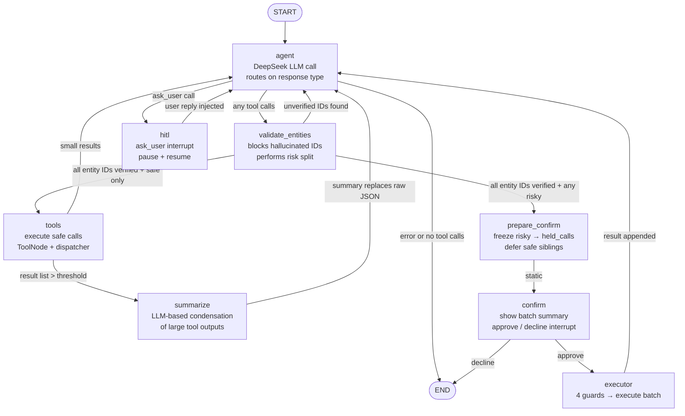

# LangGraph Agent — Current Architecture

Last updated: 2026-06-29

## High-Level Component Map

```
FastAPI (/invoke, /resume)
    └── run_jarvis (builder.py)
            ├── DeepSeekAgentClient       openai SDK + wrap_openai + @traceable
            ├── TodoistApiClient          Todoist REST v1 API
            ├── ToolRegistry              catalogue of ToolSpecs + handlers
            ├── ToolDispatcher            mutation guard, idempotency, error envelope, tracing
            ├── ToolSelector              KeywordToolSelector or StaticToolSelector (config-driven)
            ├── IdempotencyStore          Postgres-backed (or in-memory fallback)
            ├── TracePrinter              in-memory event tracer
            ├── FileLoggingTracer         wraps TracePrinter → logs/jarvis_run_*.log
            ├── DB pool (psycopg)         thread registration + usage logging
            ├── Credentials module        per-user API key + preference resolution
            └── LangGraph StateGraph      compiled with Postgres/Redis/Memory checkpointer
```

---

## Graph Topology



---

## Node Details

### `agent` — `graph/nodes/orchestrator.py`

The only node that calls the LLM.

- Reads `messages` (full chat history) + `user_prompt` from state
- Asks `ToolSelector.select_schemas(query, registry)` which tool schemas to expose this turn
- Calls `DeepSeekAgentClient.create_message(messages, tool_schemas)`
  - `temperature=0`, `max_tokens=10_000`, `tool_choice="auto"`
  - Reasoning effort configurable (`DEEPSEEK_REASONING_EFFORT`, default "high")
  - Tenacity retry on 429 / 5xx / timeout / connection errors
  - `wrap_openai` + `@traceable` sends span to LangSmith
  - Accumulates `UsageSummary` (prompt / completion / cached / reasoning tokens)
- Appends the raw assistant message to `messages`
- Increments `turn_count`; exits to END with user-friendly message if `>= max_agent_turns` (default 20)
- Routing via `route_after_agent` (edges.py):
  1. error → END
  2. `ask_user` call → `hitl`
  3. any tool calls → `validate_entities`
  4. no tool calls → END (final answer in `final_response`)

### `validate_entities` — `graph/nodes/validate_entities.py`

Prior-read ID validation gate. Runs between the agent router and execution.

- Builds a `SeenEntityIndex` from `state["tool_results"]` — O(1) membership check for all entity IDs surfaced by prior successful reads
- Checks each tool call's entity-ID arguments (defined in `metadata.py:_ENTITY_REQUIREMENTS`) against the index
- **If all IDs verified:** performs the risk split via `partition_tool_calls(tool_calls, state)`:
  - Any risky → sets `state["next"] = "confirm"` (routes to `prepare_confirm`)
  - All safe → sets `state["next"] = "tools"`
- **If any unverified ID found:** blocks the **entire batch** — produces synthetic error messages per call telling the model to fetch first, then loops back to `agent`
- Routed via `route_by_next` (reads `state["next"]`)

### `tools` — `graph/nodes/tools.py`

Executes every safe tool call from the latest assistant message.

- Delegates to `execute_tool_calls_with_toolnode(tool_calls, tool_node, dispatcher)`
  - LangGraph `ToolNode` (with `handle_tool_errors=True`) drives execution
  - Each call returns a Jarvis result envelope `{tool_call_id, tool_name, success, content, error, mutation_blocked, classified_error}`
- Appends one `role: tool` message per result to `messages`
- Accumulates results in `tool_results`
- Conditional edge via `route_after_tools`:
  - Any result containing a list > `SUMMARIZE_THRESHOLD` (default 50) → `summarize`
  - Otherwise → `agent`

### `summarize` — `graph/nodes/summarize.py`

Query-aware condensation of large tool outputs (e.g. 50+ tasks from `get_tasks`) before the agent sees them.

- Walks backward through `messages` to find recent `role: tool` messages
- For each message whose `content` contains a list exceeding `SUMMARIZE_THRESHOLD`:

  **Bypass checks** (skip LLM summarization entirely):
  - Count/aggregate queries (`"how many"`, `"count"`, `"total number"`, etc.) with ≤100 items — the agent can count raw data itself
  - Homogeneous results (>80% identical content) — repetitive data doesn't benefit from LLM compression

  **Query-aware summarization** (when not bypassed):
  - Calls the summarizer LLM (`SUMMARIZER_MODEL`, defaults to same DeepSeek model)
  - Prompt includes the user's original request so the LLM preserves full detail for relevant tasks and abbreviates less relevant ones
  - Groups output by project; each task retains at minimum its ID and name
  - Dynamic `max_tokens` budget: ~50 tokens per task, capped at `SUMMARIZER_MAX_TOKENS_CEILING`

  **Output validation with retry**:
  - After first summary, validates that it references a sufficient fraction of original task IDs
  - Coverage threshold scales inversely with item count: ≤30 items → 90%, ≤75 → 70%, >75 → 50%
  - If validation fails, retries with a stronger instruction ("ensure you reference at least 70% of IDs")
  - If second attempt also fails validation → deterministic truncation fallback

  **On success**:
  - Replaces message `content` with the summary (what the agent LLM sees next turn)
  - Marks envelope with `summarized: true` and `original_item_count`
- Raw data remains in `tool_results` for audit/debugging
- **Retry** (network level): Tenacity-based, same pattern as orchestrator (429 / 5xx / timeout / connection)
- **Graceful degradation**: On LLM failure after retries, falls back to deterministic truncation (first N items + count note) — never crashes the graph
- Static edge → `agent`

### `hitl` — `graph/nodes/hitl.py`

Pauses the graph for user clarification.

- Extracts the primary `ask_user` call from the latest assistant message
- Extra `ask_user` calls are answered with a "only one per turn" error message
- Non-ask_user sibling calls get `deferred_tool_message` with `deferred_for_clarification: true`
- Calls `interrupt(payload)` where payload is `{type:"clarify", question, reason, missing_fields, risk, tool_call_id, thread_id, …}`
- On resume: injects `ask_user_tool_message` + `{role:"user"}` reply message, records `clarification_history`
- Static edge → `agent`

### `prepare_confirm` — `graph/nodes/prepare_confirm.py`

Freezes ALL risky calls before user approval.

- Calls `partition_tool_calls(tool_calls, state)` → splits into `(risky, safe)`
- Builds `held_calls` list: one `build_held_call` (canonicalize.py) per risky call:
  - Canonicalizes args (sorted keys, no whitespace) → SHA-256 → `hash`
  - SHA-256(canonical + thread_id + turn_count) → `idempotency_key`
  - Assigns a fresh `uuid4` as `held_call.id`
- Enriches delete calls with task content from prior tool results (for human-readable confirm messages)
- Defers only safe calls with `deferred_tool_message`
- Writes `held_calls` (list) and `pending_interrupt: "confirm"` to state
- Static edge → `confirm`

### `confirm` — `graph/nodes/confirm.py`

Shows the frozen actions to the user as a batch.

- Reads `held_calls` (list) from state
- Renders a batch summary using `metadata.py` display metadata (custom render_fn per tool type)
- Calls `interrupt({type:"confirm", held_call_ids, summary, count, tool_names})`
- On resume: normalizes reply → `"approve"` (tokens: approve/yes/confirm/ok/y) or `"decline"`
- On decline: sets `final_response` and routes to END
- Writes `confirm_decision` to state
- Conditional edge via `route_after_confirm`: approve → `executor`, decline → `END`

### `executor` — `graph/nodes/executor.py`

Deterministic batch execution after approval. Never calls the LLM.

Global guards (checked once):

| # | Guard | Failure → |
|---|-------|-----------|
| 0 | `allow_mutations` global flag | abort all (synthetic error messages) |
| 1 | `confirm_decision == "approve"` | decline all (synthetic declined messages) |

Per-call guards (checked for each held call in sequence):

| # | Guard | Failure → |
|---|-------|-----------|
| 2 | `verify_hash(held_call)` — SHA-256 of canonical args matches stored hash | skip call (abort message) |
| 3 | `held_call.id not in consumed_call_ids` | skip call (replay protection) |

On pass: loops through `held_calls` sequentially, calling `tool_dispatcher.execute_tool` for each. Appends all result messages and consumed IDs.

- Static edge → `agent`

---

## Risk Classification — `graph/risk.py`

```
classify_risk(tool_call, state) → "risky" | "low" | "read"

"risky"  → delete_todoist_task (always)
         → any mutating tool when mutation_count_this_turn >= CONFIRM_BULK_THRESHOLD (default 5)
"low"    → other mutating tools (add, update, complete, uncomplete, add_comment)
"read"   → get_* tools, get_labels
```

`partition_tool_calls` splits a tool call list into `(risky[], safe[])` using the above.

**Always-risky set** is derived from `metadata.py:_ALWAYS_RISKY_TOOLS` — currently `delete_todoist_task`.

---

## Entity Validation — `graph/entity_index.py` + `tools/metadata.py`

Prior-read ID validation prevents the model from hallucinating entity IDs for mutations.

**Entity requirements** (defined in `metadata.py:_ENTITY_REQUIREMENTS`):

| Tool | Required entity arg | Entity type |
|------|-------------------|-------------|
| `complete_task` | `task_id` | task |
| `uncomplete_task` | `task_id` | task |
| `update_todoist_task` | `task_id` | task |
| `delete_todoist_task` | `task_id` | task |
| `add_comment` | `task_id` (optional) | task |

**SeenEntityIndex** builds a set of `(entity_type, id)` tuples from all successful tool results in the thread. Any `task_id` passed to a mutating tool must have been returned by a prior read — otherwise the whole batch is blocked and the model is told to fetch first.

---

## Tool System

### Stack

```
ToolRegistry (tools/base.py)
    └── specs[]          ToolSpec(name, openai_schema, handler, mutating)
    └── handlers{}       name → Callable[[args], Any]
    └── handler_map()    snapshot for hot-path lookup
    └── mutating_names() set of mutating tool names

ToolDispatcher (tools/dispatcher.py)
    ├── allow_mutations  global mutation gate (JARVIS_ALLOW_MUTATIONS env flag)
    ├── idempotency      claim/complete lifecycle via IdempotencyStore
    ├── execute_tool()   @traceable, handles TodoistApiError + generic errors
    └── build_langchain_tools()  → ToolNode tools

ToolSelector (tools/selection.py)
    ├── StaticToolSelector   select_schemas() returns all specs (pass-through)
    └── KeywordToolSelector  narrows to 1-3 tools via keyword routing table, fallback-to-all

ToolNode (LangGraph prebuilt)
    └── wraps dispatcher.execute_tool as langchain tools
    └── handle_tool_errors=True
```

### Tool Selection — `tools/selectors/keyword.py`

The `KeywordToolSelector` narrows the full catalogue (currently 13 tools) to typically 1-3 per turn:
- Matches user query against a keyword→tool-names routing table (longest-match-first)
- Unions all matched tool names
- If `allow_mutations=False`, drops mutating tools
- If nothing matched → falls back to all tools (can only help, never degrade)
- Always includes `ask_user` regardless of selection

Configured via `get_selector(name)` — the `run_jarvis` entrypoint currently uses `"static"` by default but `"keyword"` is fully implemented and ready to swap in.

### Active Tool Catalogue

| Tool | Mutating | Risky | Entity validation |
|------|----------|-------|-------------------|
| `ask_user` | no | no (control pseudo-tool) | — |
| `get_todoist_task` | no | no | — |
| `get_tasks` | no | no | — |
| `get_tasks_by_filter` | no | no | — |
| `get_completed_todoist_tasks_by_completion_date` | no | no | — |
| `get_comments` | no | no | — |
| `get_labels` | no | no | — |
| `add_todoist_task` | yes | no (unless bulk threshold hit) | — |
| `update_todoist_task` | yes | no (unless bulk threshold hit) | `task_id` must be prior-read |
| `complete_task` | yes | no (unless bulk threshold hit) | `task_id` must be prior-read |
| `uncomplete_task` | yes | no (unless bulk threshold hit) | `task_id` must be prior-read |
| `add_comment` | yes | no (unless bulk threshold hit) | `task_id` validated when present |
| `delete_todoist_task` | yes | **always risky** | `task_id` must be prior-read |

---

## Tool Display Metadata — `tools/metadata.py`

Per-tool presentation and confirm-gate rendering. Controls how the confirm node describes pending actions to the user.

| Tool | Verb | Label | Custom renderer |
|------|------|-------|-----------------|
| `delete_todoist_task` | deleting | Delete task | Shows task content from prior-read context |
| `update_todoist_task` | updating | Update task | Shows task name + changed fields |
| `complete_task` | completing | Complete task | Shows task content from prior-read context |
| `add_todoist_task` | adding | Add task | Highlights `content` arg |

---

## State Schema — `graph/state.py`

```python
class JarvisState(TypedDict, total=False):
    # Core
    messages: List[Dict]            # system + user + assistant + tool turns
    user_prompt: str
    user_id: str
    request_source: str             # "api" | "telegram" | "cli"
    thread_id: str
    turn_count: int                 # incremented each agent node entry
    tool_results: List[Dict]        # accumulated Jarvis result envelopes

    # HITL clarification
    pending_clarification: Dict     # active interrupt payload
    clarification_history: List     # past question/reply records
    interrupted: bool
    interrupt_payload: Dict

    # Routing
    next: str                       # node hint written by nodes, read by route_by_next
    final_response: str             # terminal answer text
    error: str

    # Confirm gate
    held_calls: Optional[List[Dict]]                 # frozen risky actions (batch)
    pending_interrupt: Optional["clarify"|"confirm"]
    confirm_decision: Optional["approve"|"decline"]
    consumed_call_ids: Annotated[List[str], operator.add]  # replay protection
```

---

## Graph Assembly — `graph/assembly.py` + `graph/builder.py`

Nodes are declared as `NodeSpec` dataclasses. `build_graph` compiles them into the `StateGraph`:

```python
@dataclass
class NodeSpec:
    name: str
    node: Callable[[Any], Any]
    static_route: Optional[str] = None       # unconditional edge to one node
    router: Optional[Callable[[Any], str]] = None
    route_map: Optional[Dict[str, str]] = None  # router return key → target node
```

Adding a node = one `NodeSpec` entry + one node factory. No monolithic builder surgery.

**Current node specs (builder.py):**
1. `agent` — router: `route_after_agent` → hitl / validate_entities / end
2. `validate_entities` — router: `route_by_next` → tools / prepare_confirm / agent
3. `tools` — router: `route_after_tools` → agent / summarize
4. `summarize` — static → agent
5. `hitl` — static → agent
6. `prepare_confirm` — static → confirm
7. `confirm` — router: `route_after_confirm` → executor / end
8. `executor` — static → agent

**Reusable routers (edges.py):**
- `route_after_agent`: decision based on tool calls present / ask_user / error
- `route_after_tools`: summarize if large results, else agent
- `route_after_confirm`: approve/decline based on `confirm_decision`
- `route_by_next`: generic — reads `state["next"]`, enables future decision nodes without new edge functions

`run_jarvis` (builder.py) is the single entrypoint:
- Builds clients, registry, dispatcher, selector
- Wraps `TracePrinter` with `FileLoggingTracer` for per-run file logs
- Registers thread metadata and logs usage to Supabase (fire-and-forget)
- On first call: `app.invoke(initial_state, config)`
- On resume: `app.invoke(Command(resume=clarification_reply), config)`
- Calls `enrich_interrupt_status` to surface `interrupted`, `interrupt_payload`, `pending_interrupt`
- Writes run header + footer (timing, tokens, cache hit rate) to `logs/jarvis_run_<thread_id>.log`

---

## Idempotency — `idempotency/`

Cross-run deduplication for mutations. Prevents replay on network retries or user re-sends.

**Store interface (`IdempotencyStore` protocol):**
- `claim(key, lease_seconds)` → `ClaimResult(state: CLAIMED | COMPLETED | IN_PROGRESS, result?)`
- `complete(key, result, ttl_seconds)` → marks key as completed with cached result
- `release(key)` → releases a claim without completing

**Backends:**
- `PostgresIdempotencyStore` — durable, backed by a `tool_idempotency` table, auto-cleanup of expired entries
- `MemoryIdempotencyStore` — in-process dict, dev/test fallback

**Lifecycle in ToolDispatcher:**
1. Before executing a tool call: `claim(idempotency_key)`
2. If COMPLETED → return cached result (deduped)
3. If IN_PROGRESS → poll until resolved or timeout
4. If CLAIMED → execute tool, then `complete(key, result)`
5. On failure → `release(key)` so retries can re-claim

**Configuration:**
- `JARVIS_IDEMPOTENCY_OPERATION_TTL_SECONDS` (default 7200): how long completed operations are cached
- `JARVIS_IDEMPOTENCY_LEASE_SECONDS` (default 60): max time an in-progress claim holds
- `JARVIS_IDEMPOTENCY_WAIT_SECONDS` (default 30): how long to poll an in-progress peer
- `JARVIS_IDEMPOTENCY_POLL_INTERVAL_SECONDS` (default 0.1): poll frequency

---

## Database Layer — `db.py` + `credentials.py`

### Connection Pool (`db.py`)

Lazy-initialized shared `psycopg_pool.ConnectionPool` (min 2, max 10 connections, autocommit). Created on first access; requires `JARVIS_POSTGRES_DSN` or `DATABASE_URL`.

### Thread Registration (`builder.py:_register_thread`)

Fire-and-forget upsert to `threads` table on every run:
- New run: inserts thread with title (first 100 chars of user prompt), status, message_count
- Resume: increments message_count, updates status

### Usage Logging (`builder.py:_log_usage`)

Fire-and-forget insert to `usage_logs` table after each run:
- Records model, input/output tokens, latency_ms, linked to user via telegram_user_id

### Credentials (`credentials.py`)

Per-user credential resolution from `user_credentials` table:
- `get_credential(telegram_user_id, service)` → API key or None (falls through to env var)
- `get_user_preferences(telegram_user_id)` → preferences dict (timezone, etc.) or empty

---

## Interrupt / Resume Flow

```
First call:  POST /invoke  →  run_jarvis(user_prompt)
                                  └─ app.invoke(initial_state)
                                       └─ graph pauses at interrupt()
                                       └─ result["interrupted"] = True
                                       └─ result["interrupt_payload"] = {type, question/summary, …}
             ← 200 {interrupted: true, interrupt_payload: {…}}

Resume call: POST /resume  →  run_jarvis(clarification_reply=reply, thread_id=…)
                                  └─ app.invoke(Command(resume=reply))
                                       └─ graph resumes after interrupt()
             ← 200 {final_response: "…"}
```

Both `clarify` (HITL) and `confirm` (approval gate) share the same resume path — the `pending_interrupt` field tells the caller which kind it is.

---

## LLM & Retry

- **Orchestrator model**: `DEEPSEEK_MODEL` env var (default `deepseek-v4-flash`)
- **Reasoning effort**: `DEEPSEEK_REASONING_EFFORT` env var (default `high`)
- **Summarizer model**: `JARVIS_SUMMARIZER_MODEL` env var (defaults to same as `DEEPSEEK_MODEL`)
- **API**: OpenAI-compatible, `openai` SDK via `DEEPSEEK_BASE_URL`
- **LangSmith**: `wrap_openai` traces every completion; `@traceable` wraps `create_message` and `execute_tool`
- **Payload privacy**: inputs/outputs hidden from LangSmith by default (`LANGSMITH_HIDE_INPUTS/OUTPUTS`); opt-in via `JARVIS_TRACE_PAYLOADS`
- **Retry**: Tenacity, exponential backoff with jitter, retries on 429 / 5xx / timeout / connection (both orchestrator and summarizer)
- **Token tracking**: `UsageSummary` accumulates prompt / completion / cached / reasoning tokens per run
- **Request timeout**: `DEEPSEEK_REQUEST_TIMEOUT_SECONDS` (default 30s)

---

## Checkpointing

Configured via `JARVIS_CHECKPOINT_BACKEND`:

| Value | Backend | Notes |
|-------|---------|-------|
| `memory` | `InMemorySaver` | dev / ephemeral |
| `postgres` (auto-selected when DSN present) | `AsyncPostgresSaver` | persistent, production default |
| `redis` | `RedisSaver` | persistent |

`thread_id` is the checkpoint key. Enables multi-turn HITL and confirmation flows.

---

## Observability

- **LangSmith**: automatic via `wrap_openai` + `@traceable`; tagged with `[invocation_type]`; metadata includes request_id, thread_id, user_id, model, max_turns
- **File logs**: `logs/jarvis_run_<thread_id>.log` — header (started_at, config) + event stream via `FileLoggingTracer` + footer (duration, tokens, cache_hit_rate, reasoning_tokens)
- **TracePrinter**: event/section/payload abstraction passed through all nodes and clients
- **Usage logging**: per-run token/latency telemetry written to Supabase `usage_logs` table
- **`NULL_TRACE`**: no-op implementation used in tests

---

## System Prompt (`graph/prompts/orchestrator.py`)

```
Role: "Jarvis, Jerry's personal assistant agent"
Todoist as single app for tasks AND calendar/scheduling.
Loop priority:
  1. ASK_USER — missing info → call ask_user (pauses loop)
  2. TOOL_CALL — single well-defined action (or parallel)
  3. ANSWER — task complete; never ask questions inside ANSWER
Clarification policy:
  - Ask before acting when critical detail unknown and no confident guess
  - Don't ask when reasonable default exists — use it and state assumption
  - IMPORTANT: text-only questions auto-convert to ask_user
Confirm gate: deletions + bulk (5+) intercepted automatically
Todoist tips: conflict checking, time inference, due_string, priority inversion,
  filter syntax, no ID fabrication, timeout handling, pagination
Failure: retry once if obvious, stop + ASK_USER for irreversible failures
Formatting: clean GFM, no follow-up offers
Max turns: 20 per user turn
Runtime context appended: current date, user timezone, available tools
```

**Prompt modules:**
- `prompts/orchestrator.py` — main orchestrator policy + runtime context assembly
- `prompts/worker.py` — worker prompt (drafted, not yet wired into graph)
- `prompts/context.py` — initial message assembly, user prompt formatting with datetime

---

## Configuration — `config.py`

All settings loaded from environment via a frozen `Settings` dataclass. Key groups:

| Group | Settings |
|-------|----------|
| **DeepSeek** | model, base_url, reasoning_effort, timeout, retry attempts/delay |
| **Todoist** | rest_base_url, retry attempts/timeout/delays |
| **Graph** | allow_mutations, max_agent_turns, confirm_bulk_threshold |
| **Summarizer** | model, threshold, timeout, retry, min_id_coverage, max_tokens_ceiling |
| **Executor** | max_workers, batch_timeout, circuit_breaker_threshold, throttle_enabled |
| **Idempotency** | request_ttl, operation_ttl, lease, wait, poll_interval, cleanup_interval |
| **Persistence** | postgres_dsn, redis_url, checkpoint_backend |
| **Observability** | debug_trace, debug_payloads, langsmith_hide_payloads |
| **User** | user_timezone |

---

## Planned but Not Implemented

| Feature | Status |
|---------|--------|
| Worker sub-graphs (per-domain execution) | Worker prompt drafted; no worker nodes in graph |
| Embedding/BM25 tool selection | `ToolSelector` protocol ready; `KeywordToolSelector` implemented; no embedding variant |
| Gmail / Calendar / Notion tools | Module stubs exist (`tools/gmail/`, `tools/calendar/`, `tools/notion/`); no implementations |
| Planner node (cross-domain decomposition) | Not started; `route_by_next` supports it |
| Verification / post-condition node | Not started; mutations not verified after execution |
| Streaming token-by-token to Telegram | NDJSON streaming endpoint exists but progress events are disabled |
| Long-term memory / personalization | Not started; per-thread state only |
| Multi-user OAuth / credential onboarding | DB credential lookup exists; no OAuth flow |
