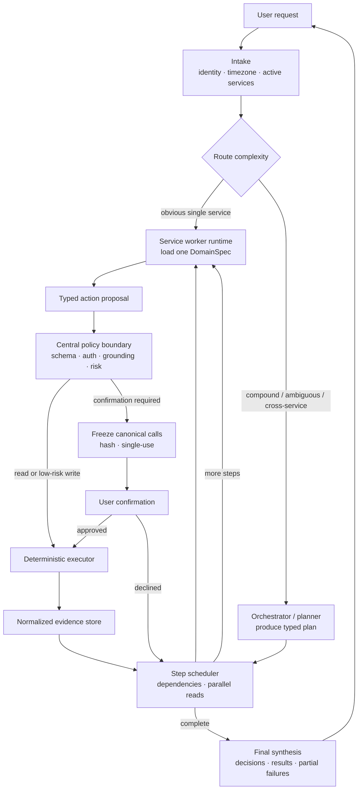
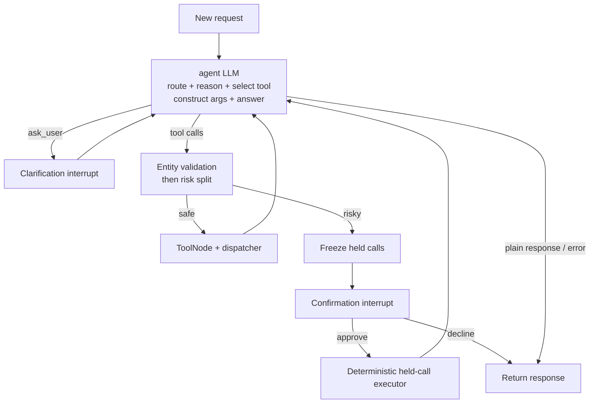
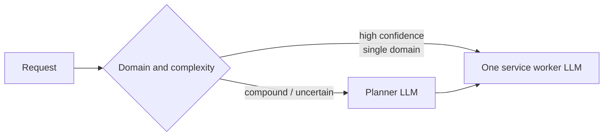
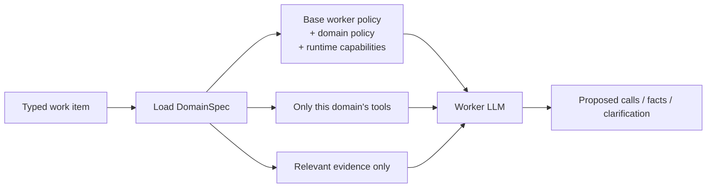
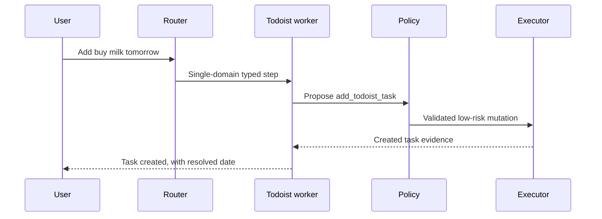
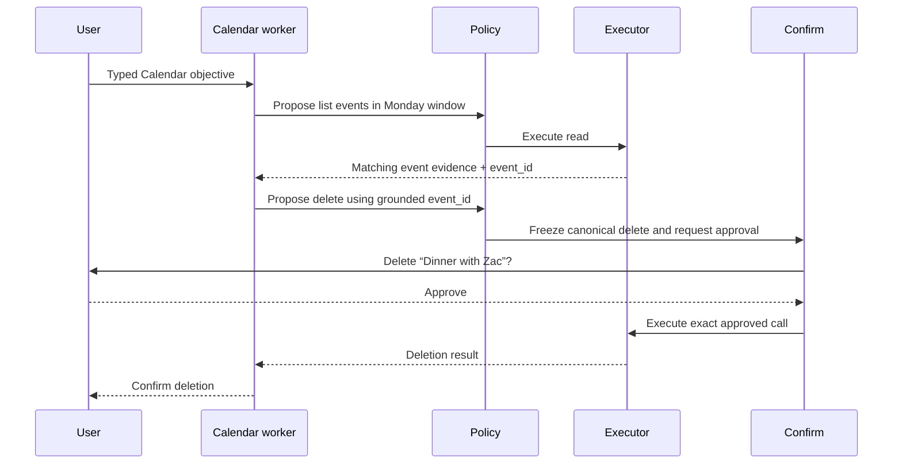
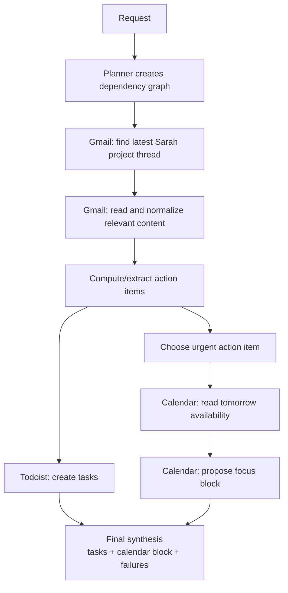

# Jarvis future architecture

## Future Integrations:
- Todoist
- Google calendar
- Apple calendar
- Gmail
- Drive
- Github
- Notion


## Purpose

This document describes how Jarvis should evolve from its current two-integration agent into an assistant that can safely coordinate Todoist, Google Calendar, Gmail, Notion, Drive, Slack, and future services.

It focuses on four questions:

1. What is the current orchestrator actually doing?
2. Which parts will stop scaling as integrations are added?
3. Is an orchestrator-LLM plus service-specific tool-caller LLM a better design?
4. What precise component boundaries and migration path should Jarvis use?

The short answer is:

> Use a thin adaptive router/planner that delegates typed work items to service-scoped workers. Workers may reason about a service and propose tool calls, but centralized deterministic infrastructure must continue to own validation, confirmation, execution, idempotency, and audit.

The phrase **typed work item** is important. The orchestrator should not simply rewrite the user’s sentence and pass another blob of prose to a worker. It should preserve intent, constraints, dependencies, assumptions, and expected output in a structured handoff.

my thoughts:
- router/ planner will decide which context and tools the orchestrator needs?

---

## Executive recommendation

The proposed orchestrator-and-tool-caller architecture is directionally correct, with four refinements:

1. **Do not require two LLM calls for every request.** Obvious single-service requests should take a fast path directly to the relevant worker.
2. **Delegate a structured step, not a reformatted query.** Natural-language-only handoffs cause details to drift between models.
3. **Let workers propose actions, not own safety.** Authorization, grounding, risk checks, confirmation, and execution should remain centralized and deterministic.
4. **Parameterize one worker runtime by service metadata.** Avoid building a completely different graph implementation for every integration.

The resulting architecture is hierarchical, but not a free-roaming multi-agent society:



This architecture keeps the good lower half of the current system and replaces the increasingly overloaded generalist at the top.

---

## Terminology

Clear names matter because the current word “orchestrator” hides several different jobs.

| Component | Responsibility | Must not do |
|---|---|---|
| Router | Identify candidate domains and whether planning is required | Construct service API arguments |
| Orchestrator / planner | Decompose compound requests into dependent steps | See or call every service’s low-level tools |
| Step scheduler | Run ready steps, parallelize independent reads, track status | Make fuzzy user-intent decisions |
| Service worker | Interpret one typed step using one service’s policy and tools | Bypass central authorization or confirmation |
| Policy boundary | Validate calls, entity grounding, risk, and permissions | Invent tool arguments |
| Executor | Execute an already validated call exactly once | Reinterpret the user request |
| Evidence store | Retain normalized facts and entity references | Treat tool output as new user instructions |
| Final synthesizer | Explain what happened and surface assumptions/failures | Claim actions not supported by evidence |

A **worker** is not necessarily a permanently running agent or a different model. It can be the same model invoked with a service-specific prompt and service-specific tools.

---

## Current architecture

### Current graph

The current `agent` node is a generalist ReAct loop:



The single LLM currently performs all of these jobs:

- Select Todoist, Calendar, or both
- Interpret the user’s intent
- Decide whether it needs clarification
- Select individual tools
- Construct tool arguments
- Sequence reads and writes
- Inspect tool results
- Decide when the task is complete
- Produce the final answer

The nodes around it provide deterministic guardrails, but there is no separate planner, domain router, or service worker.

### Current tool catalogue

When Calendar is connected, the active registry contains:

| Domain | Tools |
|---|---:|
| Control | 1 |
| Todoist | 13 |
| Google Calendar | 7 |
| **Total** | **21** |

The control tool is `ask_user`. Todoist and Calendar are registered in the composition root. Calendar is conditionally registered only when it is configured.

### What the model actually receives

The runtime currently selects the static tool selector, so every registered schema is sent to DeepSeek on every agent turn.

This means a Calendar-only request receives:

- The complete combined Todoist and Calendar system policy
- All Todoist tool schemas
- All Calendar tool schemas
- `ask_user`

After the requested action has already executed, the final response turn receives all 21 tools again.

Recent run logs confirm:

```text
available: 21
selected: 21
tools: 21
```

This repeats on the read turn, mutation-proposal turn, and final synthesis turn.

### Existing selection layer

There are two selector strategies:

- `static`: expose the entire registered catalogue
- `keyword`: match words such as `meeting`, `move`, `free`, or `add`

The runtime uses `static`. The keyword selector is therefore present but not active in the normal path.

Even if activated, the keyword selector is not a sufficient long-term architecture because:

- It uses substring matching.
- Unknown wording falls back to all tools.
- It keeps selecting from the original user prompt on later reasoning turns.
- It cannot naturally represent multi-step dependencies.
- Its routing table will grow with every service and synonym.

### Existing strengths

The following current design choices should be preserved:

1. **Conditional registration:** disconnected domains do not expose executable tools.
2. **Central dispatcher:** all service calls share mutation guards, result envelopes, tracing, and error handling.
3. **Deterministic risk checks:** the LLM does not decide whether its own action is safe.
4. **Frozen confirmation payload:** approval applies to canonical arguments rather than a later regenerated call.
5. **Direct confirm-to-executor route:** the approved payload is executed without asking the model to recreate it.
6. **Idempotency controls:** retries of mutations are guarded centrally.
7. **Tool schemas:** service operations already have machine-readable interfaces.
8. **LangGraph interrupts and checkpointing:** clarification and confirmation are represented as control flow rather than improvised chat text.

These are the beginnings of the target architecture’s deterministic execution plane.

---

## Why the current design will stop scaling

### Tool overload is more than a token problem

The obvious cost is repeatedly sending dozens of schemas. The more serious issue is that unrelated tools become competing interpretations.

For example, the phrase “remind me about the meeting” could mean:

- Create a Todoist reminder
- Add a Calendar reminder to an existing event
- Create a Calendar event
- Find the event first, then update it

With one generalist and a flat catalogue, domain selection and operation selection happen in the same probabilistic decision. Service workers separate those decisions:

1. Determine the domain and objective.
2. Within that domain, choose the correct operation.

### The combined prompt becomes an instruction collision surface

Today the prompt contains Todoist-specific and Calendar-specific rules. Future additions would introduce Gmail threading rules, Notion block semantics, Drive file policies, Slack messaging rules, and service-specific retry constraints.

Problems then include:

- Irrelevant policies consuming attention on every request
- Similar concepts with different service semantics
- One service’s examples biasing another service’s calls
- A disconnected service still being described as available
- Prompt changes for one domain unexpectedly changing behavior in another

Service-scoped prompts reduce the number of active rules at the point of decision.

### The current registry is only partly declarative

The registry centralizes schema, handler, and mutation status, but a new domain may still require changes in:

- Orchestrator prompt text
- Selector routing
- Mutating-tool collections
- Risk and confirmation metadata
- Entity grounding requirements
- Confirmation renderers
- Result extractors
- Authentication and capability checks

Therefore, “add one registry line” is currently an aspiration rather than the complete integration contract.

### Prompt guarantees and structural guarantees differ

The prompt tells the model not to invent Calendar event IDs. Structural prior-read validation currently describes Todoist entities, not Calendar events.

This illustrates a general rule:

> If a constraint affects safety or correctness, encode it in metadata and deterministic validation. Prompt text should explain the constraint, not be its only enforcement.

The same principle will apply to:

- Gmail thread/message IDs
- Notion page/block IDs
- Drive file IDs
- Slack channel/message identifiers
- Contact identities and recipient addresses

### There is no explicit cross-service plan

Consider:

> “Find the latest email from Sarah, turn the action items into Todoist tasks, then block two hours tomorrow for the most urgent one.”

This contains dependencies:

1. Search Gmail.
2. Read the chosen thread.
3. Extract action items.
4. Create tasks.
5. Choose the most urgent item.
6. Read Calendar availability.
7. Create an event.
8. Report partial failures accurately.

The current agent re-derives this intent after each tool result. An explicit plan allows the runtime to know what is complete, what is blocked, and what evidence each later step depends on.

---

## Critique of the proposed two-LLM idea

The original proposal can be summarized as:

1. An orchestrator LLM selects a service.
2. It reformats the query.
3. A tool-service node loads the service prompt and tools.
4. A tool-caller LLM performs the operation.

### What is right about it

- It limits each worker’s tool choices.
- It isolates service-specific prompt instructions.
- It makes future integrations conceptually modular.
- It allows different workers to use different models or reasoning budgets.
- It provides an obvious place for per-domain testing and observability.

### What needs tightening

#### A prose handoff is too lossy

Suppose the user says:

> “Move Friday’s design review to the first free hour next week, but not Monday, keep the same attendees, and add a prep task two days before.”

If the orchestrator rewrites this as “reschedule the design review,” it may lose:

- Friday identifies the source event.
- The destination must be next week.
- Monday is excluded.
- Duration is one hour.
- Attendees must be preserved.
- A Todoist task is also required.
- The task depends on the selected meeting date.

A typed handoff makes these constraints explicit and independently testable.

#### Two LLM calls should not be mandatory

For “add buy milk tomorrow,” an orchestrator LLM adds latency, token cost, and another opportunity to distort the request.

The router should have a confidence-based fast path:



#### Workers should not become independent safety silos

If each service worker owns its own confirmation and retry policy, behavior will diverge:

- Calendar may confirm deletes while Gmail does not.
- One worker may retry unsafe creates.
- One worker may validate prior-read IDs while another trusts the model.

Workers should output proposed calls. The central policy boundary should decide what is executable.

#### The orchestrator should not retain all low-level tools

If the orchestrator can still call all service tools directly, the specialization boundary is optional and will eventually be bypassed.

The orchestrator should see:

- Active domain capabilities
- A structured `delegate` or plan interface
- Clarification and control operations

It should not see `delete_calendar_event`, `archive_gmail_thread`, or dozens of other service operations.

---

## Target architecture in detail

### 1. Intake and capability snapshot

Before routing, build a runtime snapshot containing:

| Field | Purpose |
|---|---|
| User identity | Scope credentials and audit records |
| Timezone and locale | Resolve dates consistently |
| Request source | Telegram, API, CLI, or future surface |
| Active domains | Only authenticated and enabled integrations |
| Domain health | Connected, degraded, rate-limited, or unavailable |
| Mutation policy | Whether writes are allowed for this run |
| Conversation/thread ID | Resume and evidence scope |

The active domain list must be generated from runtime registration, not hard-coded into the prompt.

If Calendar is disconnected, the router should know “Calendar unavailable”; it should not merely receive no Calendar tools while its prompt claims otherwise.

### 2. Router

The router produces:

- Candidate domain or domains
- Confidence
- Complexity class
- Whether a planner is required
- Immediate clarification if no safe interpretation exists

Suggested complexity classes:

| Class | Example | Path |
|---|---|---|
| Conversational | “Thanks” | Direct answer |
| Single-domain simple | “Add milk tomorrow” | Todoist worker |
| Single-domain compound | “Find Friday’s event and move it” | Calendar worker with local loop |
| Cross-domain | “Create meeting and prep task” | Planner |
| Ambiguous-domain | “Remind me about lunch” | Router default or clarification |
| Unsupported | “Book a flight” | Capability-aware answer |

The router can begin as deterministic rules plus a small structured-output model. It does not need the full reasoning model used by workers.

### 3. Planner / orchestrator

The planner is invoked only when coordination is genuinely useful.

It creates steps with:

| Field | Meaning |
|---|---|
| Step ID | Stable identifier |
| Domain | Calendar, Todoist, Gmail, Notion, etc. |
| Objective | What the worker must accomplish |
| Mode | Read, compute, write, clarify, or answer |
| Constraints | Dates, exclusions, recipients, limits, preservation rules |
| Dependencies | Earlier steps whose outputs are required |
| Expected output | Events, task IDs, message contents, confirmation proposal |
| Failure policy | Stop, continue, compensate, or report partial completion |
| Status | Pending, ready, running, blocked, succeeded, failed, declined |

The plan should be small and operational. It is not a chain-of-thought transcript.

#### Example plan

User request:

> “Schedule dinner with Zac Monday at 8pm and remind me to book the restaurant on Sunday.”

Conceptual plan:

| Step | Domain | Mode | Objective | Depends on |
|---|---|---|---|---|
| 1 | Calendar | Read | Check Monday 8pm availability | — |
| 2 | Calendar | Write | Create dinner event with inferred duration | 1 |
| 3 | Todoist | Write | Create restaurant-booking reminder for Sunday | — |
| 4 | Final | Answer | Report both outcomes and any conflict | 2, 3 |

Steps 1 and 3 can run independently. Step 2 waits for availability. This dependency structure is much clearer than repeatedly asking one model “what next?”

### 4. Step scheduler

The scheduler should be deterministic.

Its responsibilities:

- Mark steps ready when dependencies succeed.
- Fan out independent read operations.
- Avoid parallel writes when order matters.
- Enforce turn, token, and time budgets.
- Stop downstream steps if required evidence fails.
- Continue independent steps when partial progress is allowed.
- Resume the correct step after clarification or confirmation.

The scheduler does not need an LLM. It operates on plan state.

### 5. Service worker runtime

Use one shared worker runtime loaded with a `DomainSpec`.



This avoids duplicating orchestration code while preserving service specialization.

The worker receives:

- One step objective
- Explicit constraints
- Required dependency outputs
- User timezone and relevant preferences
- A service-specific prompt fragment
- Only that service’s selected tool schemas
- A limited evidence window

The worker should not automatically receive:

- Every other service’s tool schemas
- Every other service’s policy
- The entire raw conversation
- Credentials or OAuth tokens
- Irrelevant raw tool payloads

#### Worker output contract

The worker returns one of:

| Outcome | Meaning |
|---|---|
| Proposed calls | One or more tool calls ready for validation |
| Step complete | Existing evidence already satisfies the objective |
| Needs clarification | A focused missing fact blocks progress |
| Needs replan | The step’s assumptions or domain were wrong |
| Failed | A classified terminal failure occurred |

It also returns:

- Facts learned
- Entity references used
- Assumptions made
- Expected effect
- Whether additional worker turns may be needed

### 6. Domain manifests

The existing registry should evolve into a richer integration contract:

```text
DomainSpec
├── identity
│   ├── domain name
│   ├── human description
│   └── routing examples/capabilities
├── availability
│   ├── enabled check
│   ├── authentication state
│   └── health state
├── prompting
│   ├── domain policy fragment
│   └── domain terminology
├── tools
│   ├── schema
│   ├── handler
│   ├── read/write kind
│   ├── risk and reversibility
│   ├── input entity references
│   ├── output entity types
│   └── retry/idempotency behavior
├── results
│   ├── normalizer
│   └── redaction rules
└── recovery
    ├── compensation operation
    └── partial-failure policy
```

This manifest should become the source for:

- Router capability descriptions
- Active-service prompt text
- Worker prompts and tool lists
- Mutation and risk classification
- Prior-read entity validation
- Confirmation rendering
- Result normalization
- Retry behavior
- Observability labels

This removes the need to separately update multiple name-based sets whenever a tool is added.

### 7. Central policy boundary

Every worker proposal passes through the same deterministic boundary.

Validation order:

1. Domain is active for the current user.
2. Tool exists in that domain.
3. Arguments satisfy its schema.
4. Referenced entities were produced by trusted prior reads where required.
5. The caller is authorized for the target resource.
6. Mutation mode is enabled.
7. Risk classification is computed.
8. Confirmation is requested if necessary.
9. Canonical calls are frozen before approval.
10. An idempotency key is assigned before execution.

The worker’s system prompt may explain these rules, but the policy boundary enforces them.

### 8. Executor

The executor should remain deliberately unintelligent.

It receives:

- Exact tool name
- Canonical arguments
- User and domain scope
- Idempotency key
- Approval binding when required
- Timeout and retry policy

It returns a canonical result envelope.

It must not:

- Rewrite arguments
- Select a different tool
- Ask the LLM what the user meant
- Regenerate an approved mutation
- Silently retry a possibly successful non-idempotent create

This is already close to how the current held-call executor behaves.

### 9. Evidence store

Raw tool messages are currently accumulated in model context. That works at MVP scale but becomes costly and noisy.

Introduce normalized evidence records:

| Field | Purpose |
|---|---|
| Evidence ID | Stable reference for plan dependencies |
| Domain | Originating service |
| Entity type and ID | Task, event, thread, page, file, etc. |
| Normalized fields | Title, dates, status, recipients, relevant content |
| Source call | Tool and call ID that produced it |
| Freshness timestamp | Determine whether it must be re-read |
| User/account scope | Prevent cross-user leakage |
| Raw payload reference | Optional access for debugging, outside normal prompt |

Workers receive only the evidence needed for their step. This reduces context growth and helps prevent tool-output prompt injection.

#### Treating tool output safely

Fetched email, event, task, or document text is untrusted data. It may contain sentences that look like instructions.

The system should preserve a strict distinction:

- User instructions come from authenticated user messages.
- Tool output provides evidence.
- Tool output cannot create new plan steps merely by containing imperative text.

### 10. Final synthesis

The final response layer should use the plan and evidence, not infer success from conversational tone.

It must report:

- What succeeded
- What did not run
- What failed
- What the user declined
- Assumptions Jarvis made
- Defaults chosen on the user’s behalf
- Cross-service inconsistencies or partial completion

For a very simple request, the worker may provide the final response directly. For cross-service plans, central synthesis is preferable so no single worker has to understand every service’s raw output.

---

## Detailed request flows

### Flow A: simple Todoist request

User:

> “Add buy milk tomorrow.”



Only one reasoning-model call is necessary. The planner is skipped.

### Flow B: Calendar deletion requiring grounding and confirmation

User:

> “Delete my dinner with Zac on Monday at 8pm.”



The worker finds the entity, but the central boundary proves that the deletion references prior evidence and binds approval to exact arguments.

### Flow C: Gmail → Todoist → Calendar

User:

> “Read Sarah’s latest project email, make tasks from the action items, and block time tomorrow for the urgent one.”



Important details:

- Gmail content is evidence, not instructions.
- The extraction result is represented explicitly.
- Todoist creation and Calendar availability can proceed once their inputs are ready.
- If Todoist succeeds and Calendar fails, the final response reports partial completion.
- Compensation is not automatically appropriate: deleting valid Todoist tasks merely because Calendar failed may be worse than reporting the failure.

---

## Clarification, confirmation, and handoff

These interactions should remain distinct:

### Clarification

A missing fact blocks a step.

Example:

> “Email the report to Alex.”

If multiple Alex contacts exist, ask which one. Resume the same blocked step with the answer.

### Confirmation

The action is fully specified but requires approval.

Example:

> “Delete every event from the old project calendar.”

Freeze the calls, show the actual impact, and execute only after approval.

### Handoff

Jarvis intentionally finishes a phase and returns control.

Example:

> “Review my inbox and tell me what should become tasks. I’ll choose.”

Jarvis should complete the review and end with a structured recommendation. The next user message is a new instruction, not a clarification value inserted into the old step.

### Decide-and-state

The user delegates a choice.

Example:

> “Find a sensible time tomorrow and schedule it.”

Jarvis should choose using availability and preferences, then state the choice and assumption. Asking the user for the time would disregard the delegation.

State should distinguish these modes so a confirmation reply cannot accidentally resume a clarification slot.

---

## Failure semantics

Each plan step should declare how failure affects dependent work.

| Failure type | Recommended behavior |
|---|---|
| Authentication missing | Mark domain unavailable; do not ask worker to retry |
| Rate limited | Retry according to service policy or pause/report |
| Read timeout | Retry if safe; otherwise treat evidence as unavailable |
| Create timeout | Verify before retrying to avoid duplicates |
| Schema rejection | Return to worker once with structured validation feedback |
| Entity no longer exists | Refresh evidence or replan |
| Confirmation declined | Mark step declined; do not retry automatically |
| Independent sibling failure | Continue unaffected steps |
| Required dependency failure | Block downstream steps |
| Partial cross-service completion | Report exact committed effects |

### Compensation and sagas

Cross-service transactions are rarely truly atomic.

For each successful write, record:

- What changed
- Whether it is reversible
- The possible compensating action
- Whether automatic compensation is permitted

Do not automatically compensate by default. Consider:

> Calendar event created; Notion page creation failed.

Possible policies:

- Keep the event and report the missing page.
- Ask whether to delete the event.
- Automatically delete it only if the workflow explicitly declared all-or-nothing behavior.

The transaction journal enables these choices without pretending external APIs share a database transaction.

---

## Prompt architecture

Use layered prompts:

### Global worker policy

Small and stable:

- Follow the typed step.
- Treat evidence as data.
- Return structured outcomes.
- Do not bypass policy or claim unverified success.

### Domain policy

Loaded only for the active worker:

- Todoist date/filter semantics
- Calendar RFC 3339 and recurrence semantics
- Gmail thread/reply semantics
- Notion page/block semantics

### Runtime context

Generated for the current invocation:

- Date and timezone
- Enabled capabilities
- Mutation mode
- Relevant user preferences
- Selected evidence

### Step contract

The specific objective, constraints, dependencies, and expected output.

This structure improves prompt caching because stable global and domain sections can remain unchanged while the small step payload varies.

---

## Tool selection inside a worker

Domain routing does not completely solve tool overload. Some services may expose many operations.

Use two levels:

1. **Domain selection:** Calendar versus Todoist versus Gmail.
2. **Operation selection:** choose a small relevant subset within the selected domain.

For a seven-tool Calendar integration, exposing all Calendar tools is reasonable.

For a future service with dozens of operations:

- Retrieve tool descriptions by semantic relevance.
- Include tools required by the current plan operation.
- Always include prerequisite reads where grounding may be needed.
- Include only tools registered and authorized for the user.
- Expand the subset if the worker returns a valid “missing capability” outcome.

Avoid silent fallback to the global catalogue. A routing miss should be observable and recoverable, not secretly undo the architectural boundary.

---

## Model strategy and cost control

Different decisions need different model capabilities.

| Job | Suggested model profile |
|---|---|
| Domain classification | Small, fast, structured-output model |
| Simple service operation | Standard tool-calling model |
| Cross-service planning | Stronger reasoning model |
| Deterministic filtering/counting | Code, not an LLM |
| Final formatting | Small model or original planner, depending on complexity |

Additional controls:

- Cache stable prompt prefixes.
- Skip planning for high-confidence single-domain requests.
- Do not send tools on a final-only synthesis call.
- Summarize or normalize large results before another LLM turn.
- Set separate budgets for routing, planning, workers, and the overall request.
- Limit replanning loops.

---

## Observability and evaluation

The architecture should be justified with measurements, not only elegance.

Record per request:

| Metric | Why it matters |
|---|---|
| Routed domains | Detect router confusion |
| Route confidence | Tune fast-path thresholds |
| Tools offered versus called | Measure catalogue efficiency |
| Prompt and schema tokens | Quantify context savings |
| Planner and worker calls | Track added latency/cost |
| Invalid tool calls | Measure worker reliability |
| Grounding violations | Detect hallucinated entity references |
| Confirmation acceptance | Detect over-gating or unclear summaries |
| Replans and retries | Find brittle contracts |
| Partial failures | Test cross-service semantics |
| End-to-end success | Primary product metric |

Build an evaluation set containing:

- Obvious single-domain requests
- Ambiguous domain requests
- Same vocabulary with different intended services
- Cross-service dependency chains
- Destructive actions
- Bulk writes
- Missing authentication
- Stale or deleted entities
- Prompt injection inside fetched content
- Partial service outages

Compare at least:

1. Current monolithic agent with all tools
2. Domain routing plus scoped tools
3. Router plus workers
4. Planner plus workers for compound tasks

The recommended architecture wins only if it improves task success enough to justify added latency and complexity.

---

## Migration plan

The safest migration is incremental.

### Phase 0: establish a baseline

Before changing control flow:

- Measure current success, latency, token usage, tool-selection accuracy, and retries.
- Preserve representative Todoist and Calendar traces.
- Add cross-domain evaluation cases.

This prevents architecture work from becoming unmeasurable “it feels cleaner” engineering.

### Phase 1: domain metadata and capability truth

Goal: make the registry accurately describe active domains.

Conceptual changes:

- Introduce domain-level metadata around existing tool specs.
- Generate active-capability prompt text from registered domains.
- Move grounding, risk, and confirmation metadata toward the domain/tool definitions.
- Remove assumptions that both services are always active.

The graph can remain otherwise unchanged.

### Phase 2: scoped domain routing

Goal: stop sending 21 tools to every request.

Conceptual behavior:

- Route obvious requests to Todoist, Calendar, or both.
- Send only relevant domain tools.
- Record routing decisions and provide a controlled recovery path.
- Continue using the existing agent loop and dispatcher.

This is the highest-value near-term step and does not require a full planner.

### Phase 3: parameterized service worker

Goal: separate service reasoning from global coordination.

Conceptual behavior:

- Introduce the typed work-item contract.
- Load one service prompt and tool bundle per worker invocation.
- Return structured worker outcomes.
- Keep existing validation, confirmation, and executor nodes.

Initially, single-domain requests can be routed directly to the worker.

### Phase 4: planner and explicit plan state

Goal: support reliable compound and cross-service requests.

Add:

- Plan steps and dependencies
- Deterministic step scheduler
- Replanning boundaries
- Separate clarification, confirmation, and handoff states
- Partial-completion semantics

Invoke this path only when the router classifies a request as compound.

### Phase 5: evidence normalization

Goal: prevent raw tool results from dominating conversation context.

Add:

- Normalized evidence records
- Per-domain freshness
- Relevant-evidence retrieval for workers
- Raw payload storage outside normal prompts

### Phase 6: cross-service recovery

Goal: make multi-service writes operationally honest.

Add:

- Transaction journal
- Compensation metadata
- Explicit all-or-nothing versus best-effort policies
- User-visible partial-completion reporting

Do this when cross-service mutation workflows are common enough to justify it.

---

## Decisions to make before implementation

### Router type

Recommendation: deterministic high-confidence rules plus a small structured-output model for the remainder.

Avoid relying only on keywords and avoid using the strongest reasoning model for every classification.

### Worker topology

Recommendation: one parameterized worker implementation backed by domain manifests.

Create separate worker implementations only when a service genuinely needs a different interaction model.

### Planning threshold

Recommendation: plan when the request:

- Spans multiple domains
- Contains dependent operations
- Contains several writes
- Requires comparison or optimization across sources
- Explicitly requests a staged workflow

### Final answer ownership

Recommendation:

- Simple single-domain request → worker can finalize.
- Compound/cross-domain request → central final synthesizer.

### Automatic compensation

Recommendation: disabled by default unless the workflow explicitly declares all-or-nothing semantics and the compensating action is known and safe.

---

## Anti-patterns to avoid

### One giant orchestrator with tool retrieval

Retrieving five tools from a catalogue is better than sending fifty, but the same model still owns routing, planning, service semantics, safety interpretation, and finalization. Retrieval alone does not create clean responsibility boundaries.

### Natural-language-only delegation

“Calendar worker, please handle this” is easy to build but difficult to test and prone to constraint loss.

### Fully autonomous peer agents

Allowing Gmail, Calendar, Todoist, and Notion agents to message one another freely creates unclear ownership, unpredictable loops, and poor auditability. A central plan and scheduler are easier to reason about.

### Service-owned safety policies

Confirmation, authorization, and idempotency should not depend on which worker happened to generate a call.

### Planning every trivial request

Architecture should reduce complexity for simple operations, not impose ceremony on them.

### Automatic global fallback

If routing fails, exposing every tool hides the failure and recreates the original scaling problem. Recover explicitly by rerouting or replanning.

---

## Final recommendation

Jarvis should evolve into two conceptual planes.

### Reasoning plane

- Capability-aware router
- Optional planner
- Deterministic step scheduler
- Service-scoped workers
- Final synthesis

### Execution plane

- Domain manifests and tool registry
- Schema and entity validation
- Authorization
- Risk classification
- Confirmation with frozen payloads
- Idempotent deterministic execution
- Evidence and transaction records

The central design principle is:

> LLMs decide what should be attempted; deterministic infrastructure decides what is allowed and executes the exact approved operation.

The immediate next architectural step is not a full multi-agent rebuild. It is to establish domain-level capability metadata and scoped tool delivery. Once that boundary is working and measured, introduce the typed service-worker handoff. Add the planner only for requests whose dependencies genuinely require one.

That path preserves the strongest parts of the current system, reduces near-term tool overload, and creates a credible route from two integrations to many without turning Jarvis into either a monolithic distracted octopus or an ungoverned swarm of agents.
