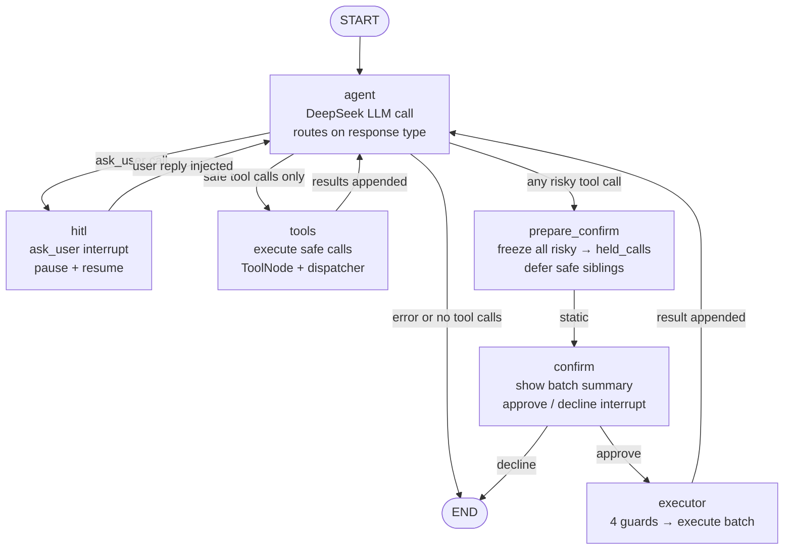

# LangGraph Agent — Current Architecture

Last updated: 2026-06-23

## High-Level Component Map

```
FastAPI (/invoke, /resume)
    └── run_jarvis (builder.py)
            ├── DeepSeekAgentClient     openai SDK + wrap_openai + @traceable
            ├── TodoistApiClient        Todoist REST API
            ├── ToolRegistry            catalogue of specs + handlers
            ├── ToolDispatcher          mutation guard, error envelope, LangSmith tracing
            ├── StaticToolSelector      pass-through (exposes all tools each turn)
            ├── TracePrinter            in-memory event tracer
            ├── FileLoggingTracer       wraps TracePrinter → logs/jarvis_run_*.log
            └── LangGraph StateGraph    compiled with InMemorySaver (default)
```

---

## Graph Topology



---

## Node Details

### `agent` — `graph/nodes/orchestrator.py`

The only node that calls the LLM.

- Reads `messages` (full chat history) + `user_prompt` from state
- Asks `ToolSelector` which tool schemas to expose this turn (currently all of them)
- Calls `DeepSeekAgentClient.create_message(messages, tool_schemas)`
  - `temperature=0`, `max_tokens=10_000`, `tool_choice="auto"`
  - Tenacity retry on 429 / 5xx / timeout / connection errors
  - `wrap_openai` + `@traceable` sends span to LangSmith
  - Accumulates `UsageSummary` (prompt / completion / cached / reasoning tokens)
- Appends the raw assistant message to `messages`
- Increments `turn_count`; exits to END if `>= max_agent_turns` (default 20)
- Sets `state["next"]`; routing is determined by `route_after_agent` (edges.py):
  1. error → END
  2. `ask_user` call → `hitl`
  3. any risky tool call → `prepare_confirm`
  4. safe tool calls → `tools`
  5. no tool calls → END (final answer in `final_response`)

### `tools` — `graph/nodes/tools.py`

Executes every safe tool call from the latest assistant message.

- Delegates to `execute_tool_calls_with_toolnode(tool_calls, tool_node, dispatcher)`
  - LangGraph `ToolNode` (with `handle_tool_errors=True`) drives execution
  - Each call returns a Jarvis result envelope `{tool_call_id, tool_name, success, content, error, mutation_blocked, classified_error}`
- Appends one `role: tool` message per result to `messages`
- Accumulates results in `tool_results`
- Static edge → `agent`

### `hitl` — `graph/nodes/hitl.py`

Pauses the graph for user clarification.

- Extracts the primary `ask_user` call from the latest assistant message
- Extra `ask_user` calls are answered with a "only one per turn" error message
- Non-ask_user sibling calls get `deferred_tool_message` with `deferred_for_clarification: true`
- Calls `interrupt(payload)` where payload is `{type:"clarify", question, reason, missing_fields, risk, tool_call_id, thread_id, …}`
- On resume: injects `ask_user_tool_message` + `{role:"user"}` reply message, records `clarification_history`
- Static edge → `agent`

### `prepare_confirm` — `graph/nodes/prepare_confirm.py`

Freezes ALL risky calls before user approval.

- Calls `partition_tool_calls(tool_calls, state)` → splits into `(risky, safe)`
- Builds `held_calls` list: one `build_held_call` (canonicalize.py) per risky call:
  - Canonicalizes args (sorted keys, no whitespace) → SHA-256 → `hash`
  - SHA-256(canonical + thread_id + turn_count) → `idempotency_key`
  - Assigns a fresh `uuid4` as `held_call.id`
- Enriches delete calls with task content from prior tool results
- Defers only safe calls with `deferred_tool_message`
- Writes `held_calls` (list) and `pending_interrupt: "confirm"` to state
- Static edge → `confirm`

### `confirm` — `graph/nodes/confirm.py`

Shows the frozen actions to the user as a batch.

- Reads `held_calls` (list) from state
- Renders a batch summary (single action or numbered list for multiple)
- Calls `interrupt({type:"confirm", held_call_ids, summary, count, tool_names})`
- On resume: normalizes reply → `"approve"` (tokens: approve/yes/confirm/ok/y) or `"decline"`
- On decline: sets `final_response` and routes to END
- Writes `confirm_decision` to state
- Conditional edge via `route_after_confirm`: approve → `executor`, decline → `END`

### `executor` — `graph/nodes/executor.py`

Deterministic batch execution after approval. Never calls the LLM.

Global guards (checked once):

| # | Guard | Failure → |
|---|-------|-----------|
| 0 | `allow_mutations` global flag | abort all (synthetic error messages) |
| 1 | `confirm_decision == "approve"` | decline all (synthetic declined messages) |

Per-call guards (checked for each held call in sequence):

| # | Guard | Failure → |
|---|-------|-----------|
| 2 | `verify_hash(held_call)` — SHA-256 of canonical args matches stored hash | skip call (abort message) |
| 3 | `held_call.id not in consumed_call_ids` | skip call (replay protection) |

On pass: loops through `held_calls` sequentially, calling `tool_dispatcher.execute_tool` for each. Appends all result messages and consumed IDs.

- Static edge → `agent`

---

## Risk Classification — `graph/risk.py`

```
classify_risk(tool_call, state) → "risky" | "low" | "read"

"risky"  → delete_todoist_task
         → any mutating tool when mutation_count_this_turn >= CONFIRM_BULK_THRESHOLD
"low"    → other mutating tools (add, update, complete)
"read"   → get_* tools
```

`partition_tool_calls` splits a tool call list into `(risky[], safe[])` using the above.

---

## Tool System

### Stack

```
ToolRegistry (tools/base.py)
    └── specs[]          ToolSpec(name, description, parameters, is_mutating)
    └── handlers{}       name → Callable[[args], Any]
    └── handler_map()    snapshot for hot-path lookup
    └── mutating_names() set of mutating tool names

ToolDispatcher (tools/dispatcher.py)
    ├── allow_mutations  global mutation gate (ALLOW_MUTATIONS env flag)
    ├── execute_tool()   @traceable, handles TodoistApiError + generic errors
    └── build_langchain_tools()  → ToolNode tools

ToolSelector (tools/selection.py)
    └── StaticToolSelector  select_schemas() returns all specs (pass-through)

ToolNode (LangGraph prebuilt)
    └── wraps dispatcher.execute_tool as langchain tools
    └── handle_tool_errors=True
```

### Active Tool Catalogue

| Tool | Mutating | Risky |
|------|----------|-------|
| `ask_user` | no | no (pseudo-tool, control flow) |
| `get_todoist_task` | no | no |
| `get_tasks` | no | no |
| `get_tasks_by_filter` | no | no |
| `get_completed_todoist_tasks_by_completion_date` | no | no |
| `add_todoist_task` | yes | no (unless bulk threshold hit) |
| `update_todoist_task` | yes | no (unless bulk threshold hit) |
| `complete_task` | yes | no (unless bulk threshold hit) |
| `delete_todoist_task` | yes | **always risky** |

---

## State Schema — `graph/state.py`

```python
class JarvisState(TypedDict, total=False):
    # Core
    messages: List[Dict]            # system + user + assistant + tool turns
    user_prompt: str
    user_id: str
    request_source: str             # "api" | "telegram" | "cli"
    turn_count: int                 # incremented each agent node entry
    tool_results: List[Dict]        # accumulated Jarvis result envelopes

    # HITL clarification
    pending_clarification: Dict     # active interrupt payload
    clarification_history: List     # past question/reply records
    interrupted: bool
    interrupt_payload: Dict

    # Routing
    next: str                       # node hint written by nodes, read by route_by_next
    final_response: str             # terminal answer text
    error: str

    # Confirm gate
    held_calls: Optional[List[Dict]]                 # frozen risky actions (batch)
    pending_interrupt: Optional["clarify"|"confirm"]
    confirm_decision: Optional["approve"|"decline"]
    consumed_call_ids: Annotated[List[str], operator.add]  # replay protection
```

---

## Graph Assembly — `graph/assembly.py` + `graph/builder.py`

Nodes are declared as `NodeSpec` dataclasses. `build_graph` compiles them into the `StateGraph`:

```python
NodeSpec(name, node_fn, static_route=None, router=None, route_map=None)
```

Adding a node = one `NodeSpec` entry + one node factory. No monolithic builder surgery.

`run_jarvis` (builder.py) is the single entrypoint:
- Builds clients, registry, dispatcher, selector
- Wraps `TracePrinter` with `FileLoggingTracer` for per-run file logs
- On first call: `app.invoke(initial_state, config)`
- On resume: `app.invoke(Command(resume=clarification_reply), config)`
- Calls `enrich_interrupt_status` to surface `interrupted`, `interrupt_payload`, `pending_interrupt`
- Writes run header + footer (timing, token counts) to `logs/jarvis_run_<thread_id>.log`

---

## Interrupt / Resume Flow

```
First call:  POST /invoke  →  run_jarvis(user_prompt)
                                  └─ app.invoke(initial_state)
                                       └─ graph pauses at interrupt()
                                       └─ result["interrupted"] = True
                                       └─ result["interrupt_payload"] = {type, question/summary, …}
             ← 200 {interrupted: true, interrupt_payload: {…}}

Resume call: POST /resume  →  run_jarvis(clarification_reply=reply, thread_id=…)
                                  └─ app.invoke(Command(resume=reply))
                                       └─ graph resumes after interrupt()
             ← 200 {final_response: "…"}
```

Both `clarify` (HITL) and `confirm` (approval gate) share the same resume path — the `pending_interrupt` field tells the caller which kind it is.

---

## LLM & Retry

- **Model**: `DEEPSEEK_MODEL` env var (default `deepseek-reasoner`)
- **API**: OpenAI-compatible, `openai` SDK
- **LangSmith**: `wrap_openai` traces every completion; `@traceable` wraps `create_message` and `execute_tool`
- **Retry**: Tenacity, exponential backoff, retries on 429 / 5xx / timeout / connection
- **Token tracking**: `UsageSummary` accumulates prompt / completion / cached / reasoning tokens per run

---

## Checkpointing

Configured via `JARVIS_CHECKPOINT_BACKEND`:

| Value | Backend | Notes |
|-------|---------|-------|
| `memory` (default) | `InMemorySaver` | dev / ephemeral |
| `postgres` | `AsyncPostgresSaver` | persistent |
| `redis` | `RedisSaver` | persistent |

`thread_id` is the checkpoint key. Enables multi-turn HITL and confirmation flows.

---

## Observability

- **LangSmith**: automatic via `wrap_openai` + `@traceable`; tagged with `[invocation_type]`
- **File logs**: `logs/jarvis_run_<thread_id>.log` — header/footer (timing, tokens, turns) + event stream via `FileLoggingTracer`
- **TracePrinter**: event/section/payload abstraction passed through all nodes and clients
- **`NULL_TRACE`**: no-op implementation used in tests

---

## System Prompt (`graph/prompts/orchestrator.py`)

```
Role: "Jarvis, Jerry's personal orchestrator agent"
Loop priority:
  1. ASK_USER — missing info → call ask_user (pauses loop)
  2. TOOL_CALL — single well-defined action
  3. ANSWER — task complete; never ask questions inside ANSWER
Clarification: ask before acting when parameter unknown and no sensible default
Reasoning: default Think High; Think Max only for 4+ dependent steps
Max turns: 20 per user turn
Output: GitHub-Flavored Markdown
Appended at runtime: current date, available tools, graph compatibility note
```

---

## Planned but Not Implemented

| Feature | Status |
|---------|--------|
| `DISPATCH` / worker sub-graphs | Prompt references it; no `dispatch_workers` tool or worker nodes exist |
| Retrieval-based tool selection | Seam exists (`ToolSelector` protocol); current impl is pass-through |
| Gmail / Calendar / Notion tools | Module stubs exist (`tools/gmail/`, `tools/calendar/`, `tools/notion/`); no implementations |
| Streaming token-by-token to Telegram | NDJSON streaming endpoint exists but progress events are disabled |
