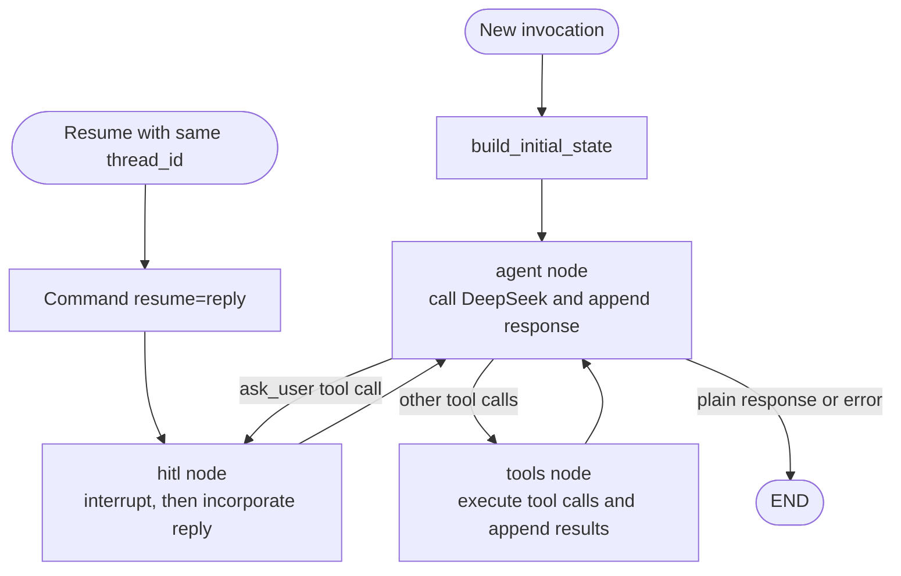

# Editing the Jarvis LangGraph

This guide explains the current Jarvis graph at the level needed to safely add or change nodes, state fields, routes, tools, and human-in-the-loop (HITL) behavior. It describes the live modular implementation under `agents/agent_api/app/`, not the older compatibility imports in `agents/jarvis.py` or `agents/agent_api/app/service.py`.

## The graph in one picture



The graph has three nodes:

| Node | Main responsibility | Reads | Writes |
| --- | --- | --- | --- |
| `agent` | Calls the LLM and decides whether the response is final or contains tool calls | `messages`, `turn_count` | `messages`, `turn_count`, `final_response`, `error`, `next` |
| `tools` | Executes all tool calls from the latest assistant message | `messages`, `tool_results` | `messages`, `tool_results`, `next` |
| `hitl` | Pauses for one clarification, then records the reply and closes or defers tool calls | `messages`, identity/source fields, clarification history | `messages`, `clarification_history`, HITL status fields, `next` |

The graph structure is assembled in [`agents/agent_api/app/graph/builder.py`](../agents/agent_api/app/graph/builder.py). Routing logic lives separately in [`agents/agent_api/app/graph/edges.py`](../agents/agent_api/app/graph/edges.py).

## Where to edit what

| Desired change | Primary file | Often also update |
| --- | --- | --- |
| Add or change a state field | [`graph/state.py`](../agents/agent_api/app/graph/state.py) | `build_initial_state`, nodes, API schema, tests |
| Add a node | New file under [`graph/nodes/`](../agents/agent_api/app/graph/nodes/) | `nodes/__init__.py`, `builder.py`, routing, compatibility exports, tests |
| Change a branch condition | [`graph/edges.py`](../agents/agent_api/app/graph/edges.py) | route map in `builder.py`, node-produced state, tests |
| Change LLM behavior | [`graph/nodes/orchestrator.py`](../agents/agent_api/app/graph/nodes/orchestrator.py) or [`graph/prompts.py`](../agents/agent_api/app/graph/prompts.py) | tool schemas and graph tests |
| Add or change a tool | [`tools/todoist/schemas.py`](../agents/agent_api/app/tools/todoist/schemas.py) and [`tools/todoist/tools.py`](../agents/agent_api/app/tools/todoist/tools.py) | client, mutation allowlist, tests |
| Change clarification behavior | [`graph/nodes/hitl.py`](../agents/agent_api/app/graph/nodes/hitl.py) | state, `/resume`, Telegram pending state, tests |
| Change initial inputs | `build_initial_state` in [`graph/builder.py`](../agents/agent_api/app/graph/builder.py) | API request schemas and callers |
| Change persistence | [`checkpointing/`](../agents/agent_api/app/checkpointing/) | config, deployment environment, resume tests |

## How state moves through the graph

`JarvisState` is a `TypedDict` in `graph/state.py`. LangGraph passes the current state into each node. A node returns an update, which becomes the state seen by the next node.

The current nodes use this convention:

```python
def example_node(state: JarvisState) -> JarvisState:
    return {
        **state,
        "some_field": new_value,
        "next": "agent",
    }
```

Spreading `**state` preserves fields the node does not change. LangGraph permits partial updates, but this codebase currently returns full state objects; follow that local convention unless deliberately refactoring state channels.

The schema has no reducers or annotated merge functions. Each field is effectively a last-value channel. Lists therefore do **not** append automatically. Nodes explicitly preserve and append them:

```python
"tool_results": state.get("tool_results", []) + results
```

This matters if the graph later gains parallel branches: two nodes writing the same last-value field can conflict or overwrite one another. Before adding fan-out, define intentional reducers for shared aggregate fields or give each branch its own output field.

### State field groups

**Conversation and loop state**

- `messages`: the complete OpenAI-compatible message sequence. It includes system/user messages, assistant tool calls, tool results, DeepSeek-specific fields such as `reasoning_content`, and HITL replies. Preserve raw message dictionaries.
- `turn_count`: incremented only by the `agent` node. The maximum-turn guard is checked before the next LLM call.
- `next`: a diagnostic description of the intended next node. It does not itself route the graph; `route_after_agent()` and the explicit edges do that.

**Request identity**

- `user_prompt`, `user_id`, `request_source`, `thread_id`: request metadata used by HITL payloads, logging, and callers.
- `thread_id` is also placed in LangGraph's invocation config. That configurable ID, not merely the copy inside state, selects the checkpoint used for resume.

**Results and terminal state**

- `tool_results`: structured accumulated tool outcomes for the API response and logs.
- `final_response`: populated when the LLM returns no tool calls, or with a user-facing terminal error.
- `error`: machine/debug failure detail. Routing ends immediately when this is truthy.

**HITL state**

- `clarification_history`: completed question/reply records accumulated after resumes.
- `pending_clarification`, `interrupted`, and `interrupt_payload`: runner-facing convenience fields. `enrich_interrupt_status()` derives them from LangGraph's `__interrupt__` result after `app.invoke()` returns.

## One normal run, step by step

1. `run_jarvis()` creates or accepts a `thread_id`, builds the clients and dispatcher, and compiles the graph with a checkpointer.
2. For a new run it invokes the graph with `build_initial_state(...)`. The initial `messages` contain the system prompt and timestamped user prompt.
3. `agent` deep-copies `messages`, calls DeepSeek with the available tool schemas, appends the raw assistant response, and increments `turn_count`.
4. `route_after_agent()` examines the latest assistant message:
   - existing `error` -> `END`;
   - any `ask_user` call -> `hitl`;
   - any other tool calls -> `tools`;
   - no tool calls -> `END`.
5. `tools` executes the batch and appends one `role: tool` message per result. Its fixed edge returns to `agent` so the LLM can synthesize or continue.
6. A plain assistant message sets `final_response`; routing reaches `END`.
7. The runtime enriches interrupt status, writes tracing/log output, and returns state. API adapters convert it to `completed`, `interrupted`, or `failed`.

## HITL and resume are different from an ordinary edge

`hitl` calls LangGraph's `interrupt(payload)`. Execution pauses at that call and the checkpointer saves enough state to continue later. The first invocation returns an `__interrupt__` item; code after `interrupt()` has not run yet.

To resume, the caller must provide both:

- the same `thread_id`; and
- `Command(resume=clarification_reply)`.

`run_jarvis()` creates that command when `clarification_reply` is supplied. The FastAPI `/resume` route and local CLI loop both use this path.

After resume, execution continues inside the existing `hitl` node. It appends:

1. a synthetic tool response closing the primary `ask_user` tool call;
2. failure/deferred tool responses for any other calls emitted in the same assistant turn; and
3. the human reply as a new user message.

It then records `clarification_history` and follows the fixed `hitl -> agent` edge. Deferred tools are intentionally **not** executed after approval; the model must issue a clean new tool call on its next turn.

Practical consequence: changing the HITL payload shape also affects API/Telegram display and resume expectations. Changing the checkpoint backend or losing the original checkpoint makes a `thread_id` insufficient on its own.

## Recipe: add a state field

Suppose a new node needs `plan_summary`.

1. Add the optional type to `JarvisState`:

   ```python
   plan_summary: str
   ```

2. Give fresh runs a predictable default in `build_initial_state()`:

   ```python
   "plan_summary": "",
   ```

3. Write it from the owning node while preserving other state:

   ```python
   return {**state, "plan_summary": summary, "next": "agent"}
   ```

4. Read it defensively with `state.get("plan_summary", "")`, especially while old persisted checkpoints may still exist.
5. If the value crosses the service boundary, update `AgentResponse` in `api/schemas.py` and `to_response()` in `api/routes/invoke.py`.
6. Add tests for initialization, update, persistence through another node, and resume if relevant.

Avoid storing non-serializable objects such as clients, open files, locks, or callbacks in state. Checkpointed state should remain plain data.

## Recipe: add a node and route to it

Example: insert a `review` node before completion.

1. Create `graph/nodes/review.py` with a factory if it needs injected dependencies:

   ```python
   def create_review_node(reviewer):
       def review_node(state: JarvisState) -> JarvisState:
           reviewed = reviewer.review(state.get("final_response", ""))
           return {**state, "final_response": reviewed, "next": "end"}

       return review_node
   ```

2. Register it in `create_jarvis_graph()`:

   ```python
   workflow.add_node("review", create_review_node(reviewer))
   ```

3. Make a route return the exact symbolic key and add it to the conditional mapping:

   ```python
   {"hitl": "hitl", "tools": "tools", "review": "review", "end": END}
   ```

4. Add the outgoing edge or conditional routes for the new node:

   ```python
   workflow.add_edge("review", END)
   ```

5. Update trace metadata, compatibility exports in `service.py` if public callers need the factory, and the architecture tests.

Node names, router return strings, and the conditional-edge map must agree exactly. Setting `state["next"]` to `review` does not create a route.

## Recipe: change routing safely

Keep routing functions pure: inspect state and return a route key without mutating state or performing I/O. Put business work inside nodes.

When adding a condition, decide its precedence. Current precedence deliberately sends a mixed batch containing `ask_user` and real tools to HITL, preventing mutations from running before clarification. Moving the generic `tool_calls` check above `ask_user` would break that safety property.

For every new route, test at least:

- the positive branch;
- the nearest competing branch;
- error/empty state behavior; and
- any mixed tool-call batch where ordering matters.

## Recipe: add a tool

A tool spans more than the graph node:

1. Add the OpenAI-compatible schema in `tools/todoist/schemas.py`; this is what the LLM sees.
2. Add the implementation/dispatch path in `tools/todoist/tools.py` and, if needed, the external API call in `tools/todoist/client.py`.
3. Ensure `build_todoist_langchain_tools()` exposes it to `ToolNode`.
4. If it mutates data, add its name to `MUTATING_TOOL_NAMES` so `allow_mutations=False` blocks it.
5. Update the system prompt/runtime compatibility note if the tool changes available behavior.
6. Test schema arguments, successful execution, errors, message conversion, and mutation blocking.

Do not add a normal executable implementation for `ask_user`: it is a pseudo-tool recognized by the router and consumed by the `hitl` node.

## Checkpoint and compatibility considerations

The default checkpointer is created once at import time in `checkpointing/__init__.py`. Memory, Postgres, and Redis backends are supported by configuration. HITL requires the same effective backend and checkpoint record between invoke and resume; process-local memory checkpoints do not survive a restart or another process.

State schema changes should be backward-tolerant while older checkpoints exist. Prefer optional `TypedDict` fields, `.get()` reads, and defaults. If a new field is mandatory for resumed runs, introduce an explicit state version and migration/normalization step rather than assuming all checkpoints were created by the new code.

`agents/agent_api/app/service.py` is a compatibility aggregator. New implementation belongs in the focused modules, but existing tests and older callers may import public symbols through `service.py` or `agents/jarvis.py`; re-export new public helpers there when compatibility matters.

## Validation checklist

Before considering a graph edit complete:

- Confirm the diagram still matches `create_jarvis_graph()`.
- Confirm every conditional route key appears in the builder's mapping.
- Confirm every node has a reachable incoming edge and an intentional outgoing edge.
- Confirm new state is initialized, serializable, and preserved across subsequent nodes.
- Confirm list/dict accumulation is explicit; do not assume automatic merge behavior.
- Confirm errors reach `END` with suitable `error` and `final_response` values.
- Confirm HITL resumes with the same `thread_id` and checkpointer.
- Confirm API response mapping still represents completed, interrupted, and failed runs.
- Run `python -m unittest discover -s tests/agents -p 'test_*.py'`.
- Run the broader Python test suite when checkpointing, API contracts, tool execution, or shared runtime code changed.

The most valuable tests are small fake-client graph runs: make the fake LLM emit a known sequence of assistant messages/tool calls, invoke the compiled graph, and assert the final message order, accumulated state, route outcome, and external calls. This verifies the state machine without requiring live DeepSeek or Todoist access.
