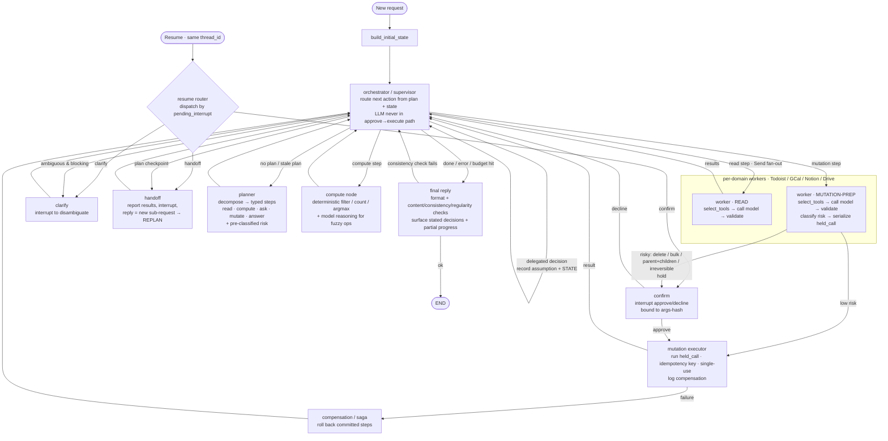

# Future architecture

## Current state:
```mermaid
flowchart TD
    Start([New invocation]) --> Initial[build_initial_state]
    Resume([Resume with same thread_id]) --> Command[Command resume=reply]
    Initial --> Agent
    Command --> HITL

    Agent[agent node<br/>call DeepSeek and append response]
    Tools[tools node<br/>execute tool calls and append results]
    HITL[hitl node<br/>interrupt, then incorporate reply]
    End([END])

    Agent -->|ask_user tool call| HITL
    Agent -->|other tool calls| Tools
    Agent -->|plain response or error| Answer User | end
    Tools --> Agent
    HITL --> Agent
```


## Ideal state


## The four human-interaction modes (the most important change)

Just look at what the *user is doing* in each case:

**Clarify** — the user said something and *you can't proceed* because you don't know what they mean. "Move one thing off my busiest day." Which thing? You're stuck. You ask. This is the user being unclear *by accident*.

**Handoff** — the user *planned a pause*. "Check everything without a time, tell me, and I'll ask you to make edits." They're not confused. They told you to stop, report, and wait. The difference from Clarify: in Clarify you ask a small question and continue the *same* task. In Handoff, you finish a chunk, hand back control, and their reply is basically a *brand new instruction* ("ok now change these three").

Here's why merging them breaks: if you treat Handoff as Clarify, your code resumes the *original* step expecting a small answer like "the dentist task." But the user's reply is "change task 4 to Friday, delete task 7" — a whole new plan. A Clarify resume path can't absorb that; it'll try to cram a multi-step instruction into a single-answer slot. They *feel* identical (both "interrupt and wait for the user") which is exactly why people merge them, and then the second query silently misbehaves.

**Confirm** — risky mutation, approve/decline. You already have this.

**Decide-and-state** — the user *handed you the decision on purpose*. "Add 'call mum' and figure out a good time." If you interrupt to ask "what time?" you've failed the instruction — they explicitly told you to decide. So you decide (say Tuesday 6pm), **don't interrupt**, but you *tell them in the final reply* what you picked and why. Your current graph has no path for this — the only way it can handle a vague time is to clarify, which is the one thing the user told it not to do.

So: same surface behavior (involve the human / don't), four genuinely different control flows. Your graph had 2. Three of your example queries need the missing ones.

## Planner — "make a plan before acting, instead of deciding move-by-move"

Right now your agent decides one action at a time, reactively. That's fine for "what's on my calendar." It falls apart on "what's my busiest day, then move one thing to balance it," because that's *five ordered steps with dependencies* — you can't move a task until you've counted per day, which needs fresh data first.

Without a planner, the model re-derives the whole multi-step intent from scratch on *every* turn. After a confirm interrupt and resume, it has to re-remember "oh right, I was in the middle of a move operation." That re-derivation is where it drifts — forgets a step, redoes a fetch, loses track of which task it was moving.

The planner writes the plan down *once* as explicit state: `[fetch, count, pick, move, report]`. Now the orchestrator isn't re-reasoning the goal each turn — it's just executing the next unchecked box. Mental model: the difference between a chef working from a written ticket vs. re-remembering the whole order every time they look up.

Keep it cheap on simple turns (1-step plan for "hi"), and let it **replan** when a Handoff reply changes the work.

## Orchestrator vs. your old agent node — "router, not doer"

Your `agent` node did two jobs: decide what to do next, *and* call the model that does it. I'm splitting those. The orchestrator only *routes* — looks at (plan, what's done, latest results) and says "next: a read" or "next: confirm." The actual model calls and tool calls happen in worker/compute nodes.

The reason this matters is the bug from last round: in your current graph, approval routes `confirm → agent → re-dispatch`. So *after* the user approves "delete task X," the model runs again and re-emits the delete — and it can emit "delete task X′" instead. The user's approval guards a payload the model is allowed to rewrite. By making the orchestrator a pure router that *can't* execute, and sending approval straight to a deterministic executor, the thing the user approved is byte-for-byte the thing that runs. You can't fix this while one node both decides and acts.

## Workers (one per app) — "stop making the model choose from 30 tools"

With just Todoist (8 tools) a single agent picks the right tool fine. Add GCal + Notion + Drive and you're at 30+ tools in one prompt. Tool-selection accuracy drops as the list grows, and you get cross-app misfires (model calls a Notion tool for a calendar task).

A worker is a sub-agent scoped to *one* app with *only* that app's tools. The orchestrator says "this is a calendar read" → calendar worker, 6 tools, picks confidently. Your "tool selection layer" lives *inside* the worker: for Todoist a fixed small list; for Drive/Notion (many ops) you retrieve the few relevant tool descriptions instead of dumping all of them. Mental model: a receptionist routing you to the right specialist, instead of one generalist who's mediocre at everything.

Read-workers return data. Mutation-workers do something specific — see below.

## Compute node — "do math in code, not in the model's head"

"Filter everything without a due time that isn't a birthday," "count tasks per day," "which day has the most" — these are *deterministic*. If you let the model eyeball your task list and decide which have no time, it will silently miss a few on a long list. Not maybe — it will. LLMs are unreliable at exhaustive filtering over many items.

So the compute node runs *actual code* for the precise stuff (filter, count, argmax), and reserves the model only for the genuinely fuzzy parts ("what's a *good* time," "*balance* the load"). The split is the point: exact operations must be exact. In your first example, the correctness of "tell me everything without a time" depends entirely on this being code.

## Mutation executor — "the approved call runs exactly as approved"

Separate deterministic node that runs the held call. When the mutation-worker prepares a risky call, it freezes it: tool name + canonical args, serialized into state as `held_call`. Confirm shows the user *that*. On approve, the executor runs *that exact frozen call* — gated by a hash so a mismatched payload can't slip through, single-use so a replay can't fire it twice, idempotency key so a retry doesn't double-delete.

This is the structural fix for the TOCTOU gap. The model proposes; a frozen artifact gets approved; the frozen artifact executes. Nothing regenerates the payload after approval.

## Compensation/saga — "undo half-finished cross-app chains"

Only relevant once one request mutates *two* apps. "Block calendar time and add a linked Notion page." Event gets created, Notion write fails. Now you've half-done it with no record. The saga node logs an undo action per committed mutation, so a mid-chain failure can roll back (delete the orphan event) or at least honestly report "I made the event but couldn't create the page." Skip this until you actually have two-app mutations — it's real but premature otherwise.

## Final reply node — "one place that owns the user-facing answer"

Three jobs beyond formatting. First, **surface stated decisions** — this is where "I scheduled call mum for Tuesday 6pm because your mornings are packed" gets said. The decide-and-state mode is useless if the decision never reaches the user. Second, **report partial progress / compensation** honestly. Third, a **consistency check**: does the answer actually match the data gathered? Caught a mismatch → loop back once. It's the quality gate, not just a prettifier.

## Resume router — "send the reply to the right waiting node"

You now have three nodes that interrupt (clarify, handoff, confirm), all resumed by the same `Command(resume=…)`. When the user replies, which node was waiting? If you don't track it, a clarification answer can land in the confirm slot and get read as "approve." So you store `pending_interrupt: "confirm"` when you interrupt, and the resume router reads it and dispatches to the right place. Small, but without it the multi-interrupt design is unsafe.

## Plus the unglamorous infra

**Durable checkpointer** (not InMemory): a real assistant resumes a confirmation 20 minutes later from your phone, not from a synchronous `input()` in the same process. Interrupts only survive if state is persisted. **Per-source freshness**: "next week, fresh" must force a *Todoist and GCal* refetch — one global "is data fresh" flag can't say "calendar fresh, Notion stale." **Budget-aware turn cap**: cross-app chains blow past 8 turns; when you hit the cap, exit gracefully with partial progress instead of erroring mid-chain.

