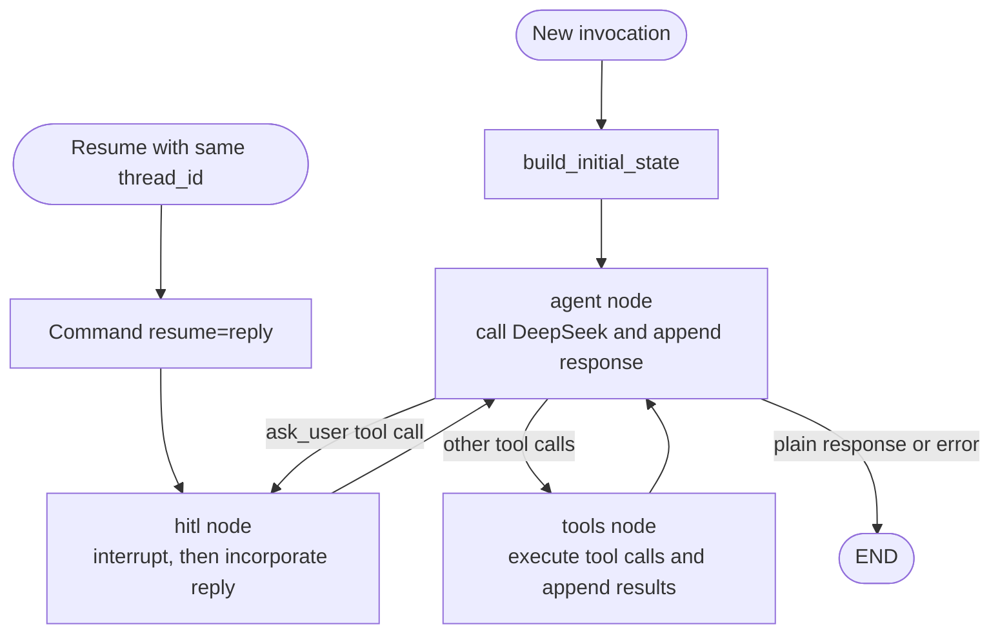
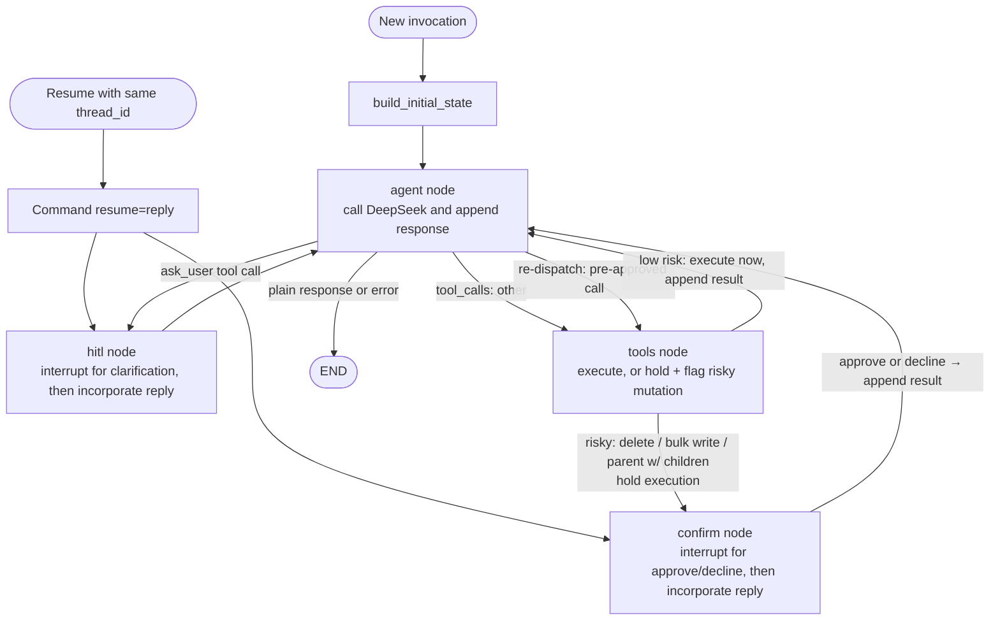

# Future architecture

## Current state:

## Ideal state

has to be abe to handle such difficult ones:
Go through my task, check everything that does not have a time, that is also not a birthday. Tell me and I will ask you to make edits.

Correct steps:
1. filter all tasks that is not birthday, and doesnt have time
2. ask back to the user what edits he wants.

currently pipeline can only do step 1.
to handle this maybe we need the dispatch workers, sequential? so filter everything, then ask back the user? idk, need to explore what workers means. or is there a more efficient way to handle this? maybe using more powerful V4 pro for orchestrator then V4 flash cheaper for workers?
